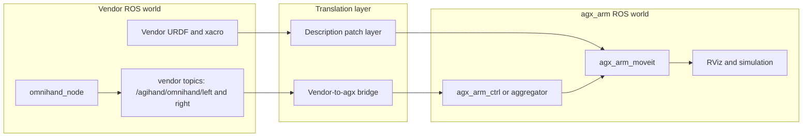
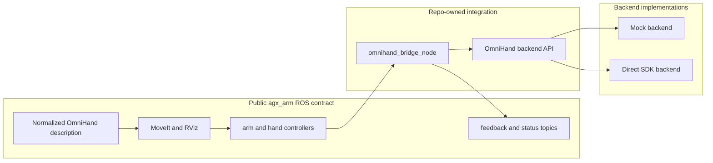
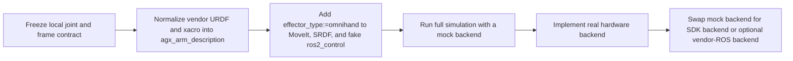

# OmniHand ROS Integration Options

last_updated: 2026-05-14
status: DECIDED_IN_PROGRESS
primary_goal: make OmniHand a valid `effector_type` in the agx_arm-centric simulation and MoveIt stack now, while keeping the live hardware backend swappable later
selected_direction: OPTION2_PUBLIC_ARCHITECTURE_PLUS_OPTION3_EXECUTION
implementation_status: SHARED_COMMAND_SURFACE_LANDED

## Decision Summary

- Keep the public ROS contract agx_arm-centric.
- Keep the OmniHand adapter below ROS.
- Start description, MoveIt, SRDF, and mock-controller integration now; do not wait for real hardware.
- Treat a bridge to vendor ROS topics as an optional backend implementation, not as the public repo contract.

## Current Implementation Status

The selected architecture is no longer only proposed. The first simulation-oriented slice is now implemented in the repo:

- normalized left and right OmniHand assets now live under the canonical `agx_arm_description` package,
- the public launch contract is frozen and implemented as `effector_type:=omnihand` plus `omnihand_type:=left|right`,
- MoveIt, SRDF, initial positions, and fake `ros2_control` now include OmniHand controller profiles,
- repo-owned `agx_arm_msgs/OmniHandStatus` and `OmniHandTactileRaw` messages now exist,
- a first repo-owned `omnihand_bridge` mock backend and launch surface now exist under `agx_arm_ctrl`,
- the bridge now accepts the shared `control/joint_states` surface used by the rest of `agx_arm_ctrl`,
- `control/omnihand/joint_trajectory` remains available as a bridge-specific compatibility path,
- `agx_arm_ctrl` can now aggregate bridge joint state into combined `feedback/joint_states` when `effector_type:=omnihand`,
- the shared `start_single_agx_arm*` launch wrappers now pass `omnihand_type` through and can optionally start the bridge,
- the bridge stays in `agx_arm_ctrl` as the Sprint 2 runtime integration point,
- Sprint 2 workspace-policy docs now exist under `docs/project`,
- and the current left-hand smoke path launches successfully through `agx_arm_moveit` with mock hardware.

What remains open:

- the first real hardware backend and device validation,
- a non-mock hand command and action surface that can replace the current shared JointState plus compatibility trajectory path where needed,
- and later reassessing package boundaries only if the non-mock backend proves `agx_arm_ctrl` is no longer the right home.

## Why This Can Start Now

The current repo already has the right integration seams for a new hand profile:

- `src/agx_arm_moveit/launch/_moveit_config_builder.py` already dispatches planning profiles by `effector_type`.
- `src/agx_arm_moveit/config/agx_arm.urdf.xacro` and `agx_arm.srdf.xacro` already swap in hand-specific description and planning groups.
- `src/agx_arm_moveit/config/agx_arm.ros2_control.xacro` already adds fake hand joints for simulation.
- `src/agx_arm_ctrl/agx_arm_ctrl/agx_arm_ctrl_single_node.py` already wraps end-effectors behind local Python abstractions.

That means simulation-first OmniHand work is mostly a contract-design and asset-normalization problem, not a hardware-blocked problem.

## Option 1: Overlay The Vendor ROS Stack And Translate Into agx_arm

Pros:

- Fastest path if the vendor ROS node becomes the only supported hardware runtime.
- Preserves vendor topic and message semantics for debugging against upstream examples.
- Can be useful as a temporary bring-up harness in the lab.

Cons:

- Creates two public ROS contracts in one repo.
- The vendor ROS path is not validated on the current `aarch64` host.
- Still requires a separate repo-owned description path for MoveIt and simulation.
- Adds remap, namespace, and controller-name translation complexity.
- Pushes vendor topic layout into the repo architecture before the hardware path is proven.

## Option 2: Repo-Owned Adapter Plus Repo-Owned ROS Bridge

Pros:

- One ROS contract for both simulation and real hardware.
- Mock backend can unblock MoveIt and RViz immediately.
- Keeps vendor types and transport details out of the rest of the repo.
- Fits the existing `effector_type` pattern in MoveIt and control.
- Makes joint naming, controller naming, and namespace handling consistent.

Cons:

- Requires more upfront interface design work.
- Needs new repo-owned status and tactile message definitions.
- Requires normalized OmniHand description assets instead of direct vendor URDF use.

## Option 3: Repo-Owned ROS Contract With Pluggable Backends

This keeps the public architecture of Option 2, but allows more than one backend behind the same repo-owned bridge.

Pros:

- Best match for the current uncertainty around `aarch64` versus `x86_64` hardware bring-up.
- Lets simulation-first work proceed now without locking the repo to a single runtime backend.
- Keeps the public ROS contract stable even if the first hardware path changes later.

Cons:

- Highest implementation complexity.
- Expands the backend test matrix.
- Needs discipline to keep the backend interface narrow and stable.

## Selected Direction

Use Option 2 as the target architecture and Option 3 as the execution strategy.

This is now the active repo direction. The current implementation already reflects the first simulation slice of that decision.

That means:

- the public ROS surface should stay agx_arm-centric,
- the wrapper should stay below ROS,
- a mock backend should unblock simulation first,
- and the real hardware backend can later be either direct SDK access or, if absolutely necessary, a vendor-ROS-backed adapter behind the same repo-owned interface.

Option 1 should remain a fallback only.

## ROS Contract Strategy

The recommended topics, actions, services, and messages should be a controlled merge of two things:

- vendor capability coverage,
- agx_arm naming and integration conventions.

The rule should be:

- preserve all vendor capabilities that are actually needed,
- do not preserve vendor topic names as the public repo contract,
- normalize naming, namespaces, frames, and controller semantics into the agx_arm stack.

In practice that means:

- keep a mapping document from vendor ROS surfaces and SDK calls to the repo-owned ROS bridge,
- use agx_arm-style public names under `control/...` and `feedback/...`,
- only keep vendor-native names inside the backend implementation and compatibility notes.

This gives you the merge you want without forcing the public ROS surface to look like two unrelated systems glued together.

## What The Wrapper Should And Should Not Be

The wrapper should:

- expose a ROS-free backend interface,
- own joint-name to vendor-index mapping,
- hide direct SDK or transport details,
- support a mock implementation for simulation,
- support later backend substitution without changing MoveIt or higher-level ROS nodes.

The wrapper should not:

- become the public ROS API,
- force the rest of the repo to speak vendor topics,
- directly mirror vendor ROS message contracts as the canonical interface.

If the vendor ROS node later becomes necessary, it should be wrapped as a backend implementation behind the same repo-owned API.

## Proposed Repo-Owned ROS Shape

### Launch And Model Conventions

| Surface | Current Pattern | OmniHand Proposal |
| --- | --- | --- |
| MoveIt arg | `effector_type:=none|agx_gripper|revo2` | add `effector_type:=omnihand` |
| Hand side arg | `revo2_type:=left|right` | add `omnihand_type:=left|right` |
| Description include | gripper/Revo2-specific xacros | add `nero_with_left_omnihand_description.xacro` and `nero_with_right_omnihand_description.xacro` |
| Fake ros2_control | arm plus hand joints | add a 10-active-joint OmniHand controller profile |
| SRDF groups | `nero_arm`, `gripper`, `hand` | keep `hand`, but define OmniHand-specific joint set and states |

### Local Joint Naming Contract

Use normalized ROS names in the repo and keep vendor-specific names inside the backend mapping.

Recommended active-joint naming rule:

- convert vendor `L_*` names to `left_*`
- convert vendor `R_*` names to `right_*`

Example active-joint set for the left hand:

- `left_thumb_roll_joint`
- `left_thumb_abad_joint`
- `left_thumb_mcp_joint`
- `left_index_abad_joint`
- `left_index_pip_joint`
- `left_middle_pip_joint`
- `left_ring_abad_joint`
- `left_ring_pip_joint`
- `left_pinky_abad_joint`
- `left_pinky_pip_joint`

The backend maps those local names to the vendor-declared active-joint order already recorded in `docs/assets/omnihand/omnihand_phase1_joint_map.md`.

### Topics, Actions, And Services

| Surface | Type | Purpose | Recommendation |
| --- | --- | --- | --- |
| `control/joint_states` | `sensor_msgs/JointState` | Shared arm plus end-effector command surface used by the current agx_arm runtime | keep as the preferred shared arm-plus-OmniHand command path |
| `feedback/joint_states` | `sensor_msgs/JointState` | Combined arm plus hand state used by MoveIt follow mode | keep as the canonical combined state |
| `feedback/omnihand/joint_states` | `sensor_msgs/JointState` | Hand-only state for debugging and direct consumers | keep implemented for hand-only debugging and direct consumers |
| `feedback/omnihand/status` | new `agx_arm_msgs/OmniHandStatus` | Device state, temperatures, currents, control mode, fault bits | keep implemented as the repo-owned status surface |
| `feedback/omnihand/tactile_raw` | new `agx_arm_msgs/OmniHandTactileRaw` | Raw tactile payloads without premature abstraction | keep implemented as the raw tactile surface |
| `control/omnihand/joint_trajectory` | `trajectory_msgs/JointTrajectory` | Bridge-specific compatibility path for hand-only or controller-oriented publishers | keep supported, but not as the only public command path |
| `control/omnihand/follow_joint_trajectory` | `control_msgs/action/FollowJointTrajectory` | Optional later controller or action surface for tighter MoveIt integration | add later if needed |
| `control/omnihand/stop` | `std_srvs/Trigger` or `std_srvs/Empty` | Safe stop or cancel hand motion | keep implemented as the bridge-local safe-stop surface |
| `control/omnihand/set_control_mode` | repo-owned service only if required | Explicit mode switching when the backend truly needs it | keep optional |

## Message Strategy Recommendation

Do not choose between pure standard messages and pure custom messages globally.

Use a split strategy:

- standard ROS messages for kinematics and motion,
- repo-owned custom messages only for OmniHand-specific diagnostics, tactile data, and backend health.

That means the first hand-control surface should be built around:

- `sensor_msgs/JointState`
- `trajectory_msgs/JointTrajectory`

And only these should become new custom messages in `agx_arm_msgs`:

- `OmniHandStatus.msg`
- `OmniHandTactileRaw.msg`

This is a better fit than reusing the current Revo2 messages, which only cover six finger-level channels and do not represent a 10-active-joint hand.

### Practical Message Rule

Use this priority order:

1. standard ROS messages when the semantics are already correct,
2. repo-owned custom messages when OmniHand-specific semantics are needed,
3. vendor message structure only as an input reference, not as the public contract.

That means:

- reuse `sensor_msgs/JointState` and `trajectory_msgs/JointTrajectory` directly,
- define `agx_arm_msgs/OmniHandStatus` and `agx_arm_msgs/OmniHandTactileRaw` in a style that matches local naming conventions,
- do not reuse the current Revo2 hand messages for OmniHand,
- do not mirror vendor messages byte-for-byte unless a real interoperability requirement forces it later.

If an existing agx message pattern is semantically compatible, reuse the pattern, not necessarily the exact message type.

## How The Repo-Owned ROS Bridge Should Look

Recommended node split:

1. `omnihand_bridge_node`
   - owns the public hand ROS topics and services
   - converts ROS commands to backend calls
   - publishes hand-only joint state, status, and tactile topics

2. `omnihand_backend`
   - pure Python or C++ interface
   - implementations: `mock_backend`, `sdk_backend`, optional `vendor_ros_backend`

3. `joint_state_aggregator` or `agx_arm_ctrl` integration
   - combines arm joint states with OmniHand joint states into `feedback/joint_states`
   - keeps MoveIt follow mode unchanged

## Clarifications

### What "fake ros2_control" means here

Yes. In this context it means the simulated `ros2_control` path used by MoveIt and RViz, not a real hardware driver.

Concretely, this is the existing mock-controller pattern in:

- `src/agx_arm_moveit/config/agx_arm.ros2_control.xacro`
- `src/agx_arm_moveit/launch/demo.launch.py`

Today it uses `mock_components/GenericSystem` plus generated controller YAML so MoveIt can plan and execute against simulated joints. For OmniHand, the same pattern should be extended with a 10-active-joint hand controller profile.

So the short answer is: yes, it is the control-group and controller surface MoveIt needs for simulation, not a claim about real hardware control.

### What "freezing conventions" means

It does not mean freezing implementation work. It means freezing the names and semantics before they spread across many files.

The things to freeze first are:

- `effector_type:=omnihand`
- `omnihand_type:=left|right`
- local joint naming, for example `left_thumb_roll_joint`
- wrist, palm, tcp, and grasp-frame semantics
- controller names
- public topic and service names
- the rule for how vendor names map into local names

Once those are written down, implementation can continue quickly without later rename churn across URDF, SRDF, controller YAML, MoveIt launch, bridge code, and tests.

### How to resolve `display.launch.py` vs `display_control.launch.py`

The current repo already hints at the split:

- `display.launch.py` is a generic visualization-oriented entry around the older `end_effector` naming style,
- `display_control.launch.py` is the control-compatible entry aligned with `effector_type`, `revo2_type`, `follow`, and `control_topic`.

For OmniHand, the canonical path should be:

- add OmniHand support to `display_control.launch.py` first,
- document `display_control.launch.py` as the agx_arm-facing launch surface,
- keep `display.launch.py` only as a simplified visualization wrapper or deprecate its end-effector branching later if it becomes redundant.

That avoids duplicating logic and avoids two partially overlapping parameter vocabularies.

### Should the OmniHand repo be forked

Yes, most likely.

Reason:

- the repo already contains local source changes for `aarch64` and socket-backed bring-up,
- those changes are no longer just transient local experiments,
- they affect backend selection, Python packaging, and runtime safety behavior.

Recommended policy:

- maintain a forked upstream mirror for OmniHand,
- keep the fork focused on build, portability, and safety patches,
- document which patches are intended for upstream contribution and which are repo-local,
- keep the agx_arm repo consuming that fork explicitly rather than relying on an untracked dirty submodule state.

Current workspace status:

- the vendored submodule now tracks the workspace fork in `.gitmodules`: `https://github.com/robyngehler/Omnihand-2025-SDK.git`,
- the canonical upstream remains `https://github.com/AgibotTech/Omnihand-2025-SDK.git` and should stay available as an `upstream` remote for sync and review,
- local portability and runtime-safety patches should continue to land in the workspace fork first and be proposed upstream selectively.

## Documentation And Sprint Placement

### Where To Document These Decisions

Use these locations:

- `docs/assets/omnihand/omnihand_ros_integration_options.md`
    - architecture choice, naming strategy, topic and message strategy, and bridge shape
- `docs/assets/omnihand/omnihand_wrapper_integration_plan.md`
    - execution phases, backend order, and simulation-first sequencing
- `docs/assets/omnihand_asset_validation.md`
    - current factual state, risks, and open gates
- future Sprint 2 project docs under `docs/project/`
    - upstream fork policy, package naming, generated-vs-source asset policy, and workspace structure
- `src/agx_arm_sim/agx_arm_description/README.md`
    - final user-facing clarification that `display_control.launch.py` is the canonical agx_arm integration entry
- `src/agx_arm_moveit/README.md`
    - final OmniHand launch examples once `effector_type:=omnihand` exists

### Which Sprint Owns What

For the current local repo workflow:

- still Sprint 1:
    - capture the architecture decision,
    - freeze the naming and interface conventions,
    - record the fork recommendation,
    - clarify the launch-entry roles,
    - document the simulation-first direction.

- now completed or in progress under Sprint 2:
    - create the actual package and directory structure for OmniHand integration,
    - normalize the vendor hand assets into the canonical description package,
    - add `effector_type:=omnihand` and mock `ros2_control` support,
    - add the first repo-owned OmniHand messages and mock-backed bridge skeleton,
    - aggregate bridge joint state into the shared `feedback/joint_states` path through `agx_arm_ctrl`,
    - extend the shared `start_single_agx_arm*` launch wrappers with OmniHand bridge arguments,
    - document repository structure, naming, generated-vs-source policy, and local workflow under `docs/project`.

- still open under Sprint 2:
    - replace the mock backend with the first real backend path,
    - decide whether the initial bridge remains inside `agx_arm_ctrl` or is split into a dedicated package once the real backend exists,
    - align the bridge command surface with the longer-term controller or action model once the non-mock backend is available.

For the canonical roadmap and progress pair in `docs/development/nero_physical_ai_roadmap.md` and `docs/development/nero_physical_ai_progress.md`, the work spans several logical sprints:

- roadmap Sprint 1:
    - discovery and decision capture
- roadmap Sprint 2:
    - package structure, fork policy, generated-vs-source policy
- roadmap Sprints 3 and 4:
    - normalized description and MoveIt simulation integration
- roadmap Sprint 7:
    - standalone real OmniHand backend bring-up
- roadmap Sprint 8:
    - OmniHand as Nero tool and payload in the physically meaningful model

So the short answer is:

- the decision and documentation work is still Sprint 1 close-out,
- the simulation-first implementation work is Sprint 2 in the local repo sequence,
- and the true hardware backend is later than that in the master roadmap.

## Simulation-First Execution Order

1. Freeze local OmniHand joint names, side argument names, and wrist-to-palm frame conventions. `done`
2. Normalize the vendor description assets into the canonical `agx_arm_description` package. `done`
3. Add `effector_type:=omnihand` plus `omnihand_type:=left|right` to MoveIt, SRDF, and fake `ros2_control`. `done`
4. Add OmniHand controller profiles and group states so RViz and MoveIt work with no hardware. `done`
5. Add the repo-owned ROS bridge on top of a mock backend. `done`
6. Add the first real backend later and switch the bridge from mock to hardware. `open`

## Practical Recommendation For This Repo

Proceed now with:

- normalized OmniHand URDF and xacro assets,
- MoveIt and SRDF integration,
- fake `ros2_control` support,
- a repo-owned ROS contract for status and control,
- a mock backend for simulation.

Do not wait for hardware to do those steps.

Wait for hardware only for:

- direct SDK or backend validation,
- timing-sensitive control semantics,
- tactile interpretation that depends on a real device,
- production tuning, safety, and fault-recovery behavior.