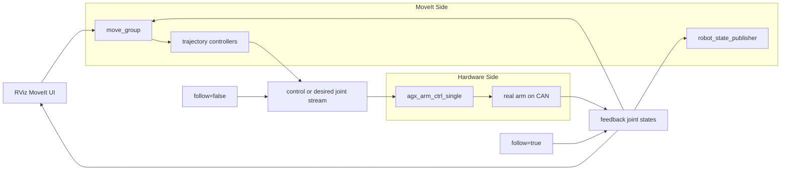

```mermaid
flowchart LR
    A[RViz MoveIt UI] --> B[move_group]
    B --> C[trajectory controllers]
    C --> D[control or desired joint stream]
    D --> E[agx_arm_ctrl_single]
    E --> F[real arm on CAN]

    F --> G[feedback joint states]
    G --> B
    G --> H[robot_state_publisher]
    G --> A

    subgraph MoveIt Side
      B
      C
      H
    end

    subgraph Hardware Side
      E
      F
    end

    I[follow=true] --> G
    J[follow=false] --> D
```