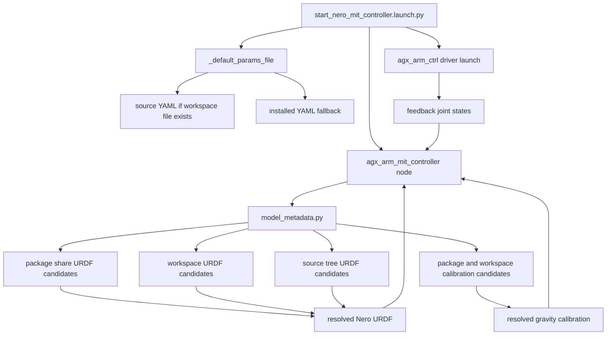

```mermaid
flowchart TD
    A[start_nero_mit_controller.launch.py] --> B[_default_params_file]
    B --> C[source YAML if workspace file exists]
    B --> D[installed YAML fallback]

    A --> E[agx_arm_ctrl driver launch]
    A --> F[agx_arm_mit_controller node]

    F --> G[model_metadata.py]
    G --> H[package share URDF candidates]
    G --> I[workspace URDF candidates]
    G --> J[source tree URDF candidates]

    G --> K[package and workspace calibration candidates]
    H --> L[resolved Nero URDF]
    I --> L
    J --> L
    K --> M[resolved gravity calibration]

    L --> F
    M --> F
    E --> N[feedback joint states]
    N --> F
```