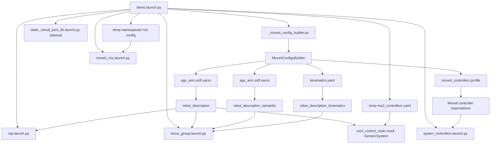

```mermaid
flowchart TD
    A[demo.launch.py] --> B[_moveit_config_builder.py]
    B --> C[MoveItConfigsBuilder]

    C --> D[agx_arm.urdf.xacro]
    C --> E[agx_arm.srdf.xacro]
    C --> F[kinematics.yaml]
    C --> G[moveit_controllers profile]

    A --> H[rsp.launch.py]
    A --> I[move_group.launch.py]
    A --> J[moveit_rviz.launch.py]
    A --> K[spawn_controllers.launch.py]
    A --> L[static_virtual_joint_tfs.launch.py optional]

    A --> M[temp ros2_controllers yaml]
    A --> N[temp namespaced rviz config]

    D --> O[robot_description]
    E --> P[robot_description_semantic]
    F --> Q[robot_description_kinematics]
    G --> R[MoveIt controller expectations]

    O --> H
    O --> I
    O --> S[ros2_control_node mock GenericSystem]
    P --> I
    Q --> I
    R --> K
    M --> S
    N --> J
```