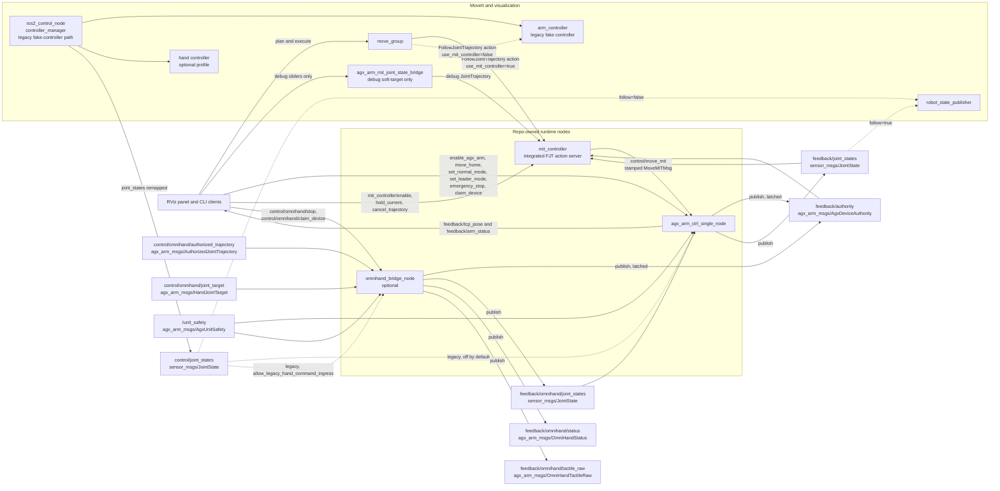
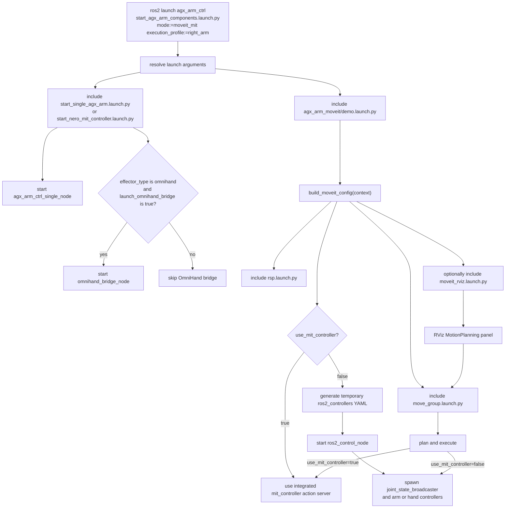
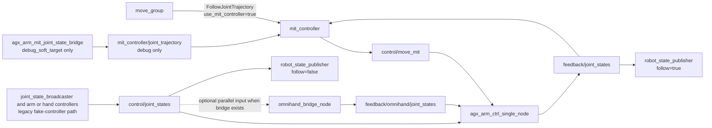
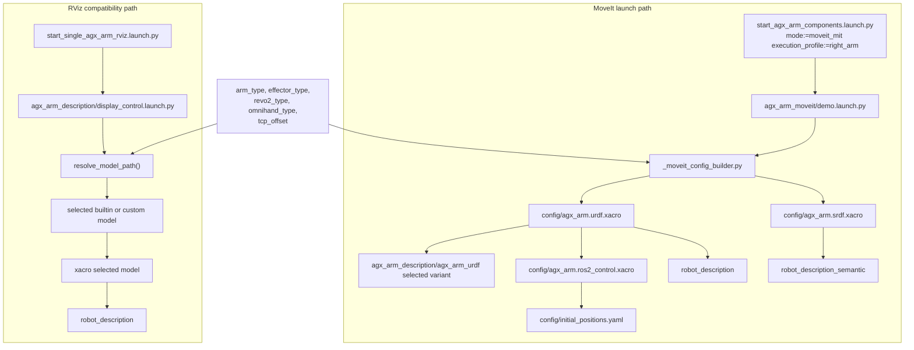
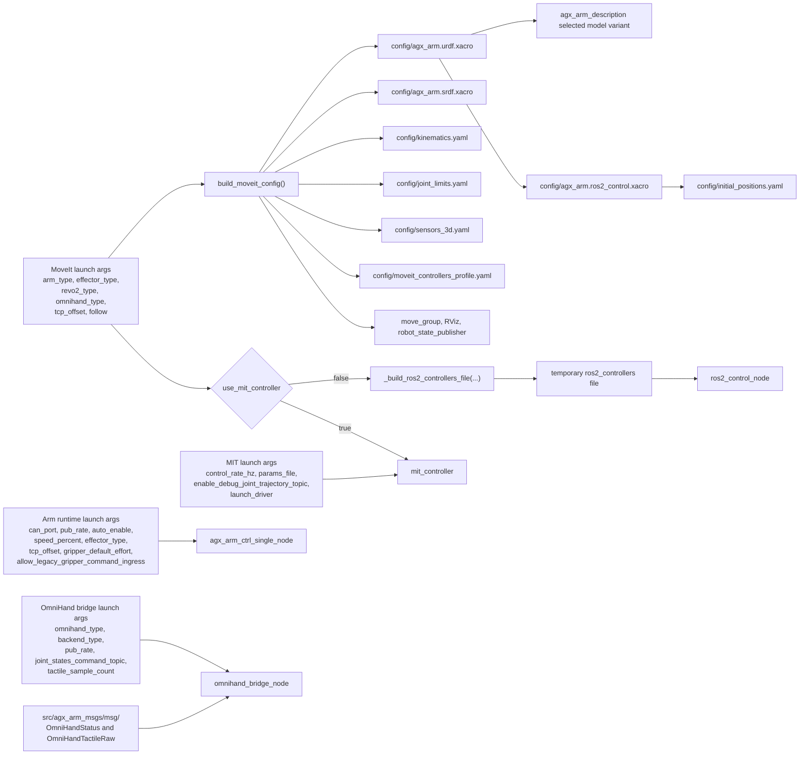

# Architecture

status: ACTIVE_BASELINE
last_updated: 2026-08-18

This document is the stable architecture reference for the current Duo baseline. It focuses on how
the repo-owned runtime surfaces interact, how launch files compose them, and where the public ROS
contract lives.

**It does not describe the control-integrity layer.** Who may command a device,
which generation a command was issued under, who owns a device's vendor SDK
session, and what happens on an e-stop or a recovery are in
`control_integrity_architecture.md`. Read that one before changing anything on a
command path; this one is about composition and wiring.

Use this together with:

- `repository_structure.md` for package ownership and documentation boundaries
- `control_integrity_architecture.md` for authority, epochs, SDK ownership, recovery, and e-stop
- `components/README.md` for the stable component index
- `../control/bringups/launches.md` for runnable entrypoints

## Architecture summary

- `src/agx_arm_ctrl` owns the runtime arm bridge, launch surfaces, and current OmniHand bridge
  integration point
- `src/agx_arm_mit_controller` owns integrated `FollowJointTrajectory`, MIT command generation, and
  gravity-aware execution
- `src/agx_arm_moveit` owns the planning baseline and fake-controller compatibility path
- `src/agx_arm_sim/agx_arm_description` remains the canonical long-term description package
- `src/duo_body_description` remains the current Duo staging surface for body-mounted system assembly
- `src/agx_arm_msgs` owns repo-specific messages such as OmniHand diagnostics and tactile payloads

## 1. ROS2 nodes and interfaces

Key contract points:

- `feedback/joint_states` is the canonical combined follow-mode state
- hand-only diagnostics stay under `feedback/omnihand/*`
- the MoveIt default path is `move_group -> mit_controller -> control/move_mit -> agx_arm_ctrl_single_node`
- the `ros2_control` branch is a compatibility path, not the preferred production execution route
- **every production command carries the authority it was issued under.** The
  arm's `MoveMITMsg` and the hand's `AuthorizedJointTrajectory` /
  `HandJointTarget` all embed `owner_id`, `device_epoch`, `unit_safety_epoch`
  and `sequence`; the receiving device admits on the stamp the command *arrived
  with* and never substitutes a field from its own state
- **the bare surfaces are legacy and off.** Shared `control/joint_states` and
  `control/omnihand/joint_trajectory` reach a device only under
  `allow_legacy_hand_command_ingress` / `allow_legacy_motion_ingress`, both
  default false. They self-stamp, so they cannot refuse a stale or reordered
  command — never describe them as authority-safe
- **four devices, four buses, four authorities.** Arms on `can_nero_left` /
  `can_nero_right` (native `mttcan`), hands on `hand_left` / `hand_right`
  (USB-CAN FD adapters). Same-side arm and hand motion runs in parallel;
  `shared_per_side` is a selectable degraded topology declared once as
  `bus_topology` in the registry

## 2. Launch and runtime flow

## 3. File interaction under launches

## 4. Config and definition dataflow

