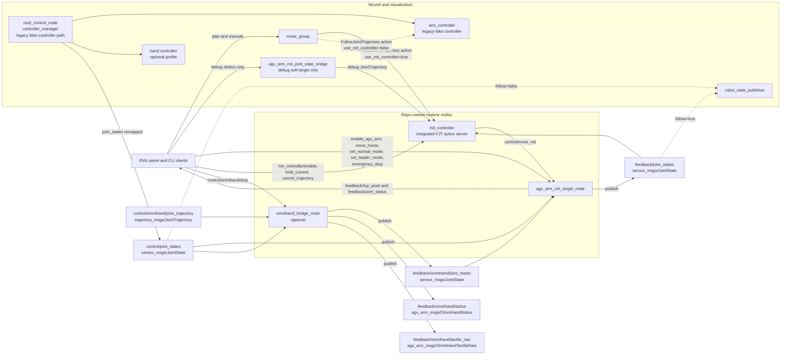
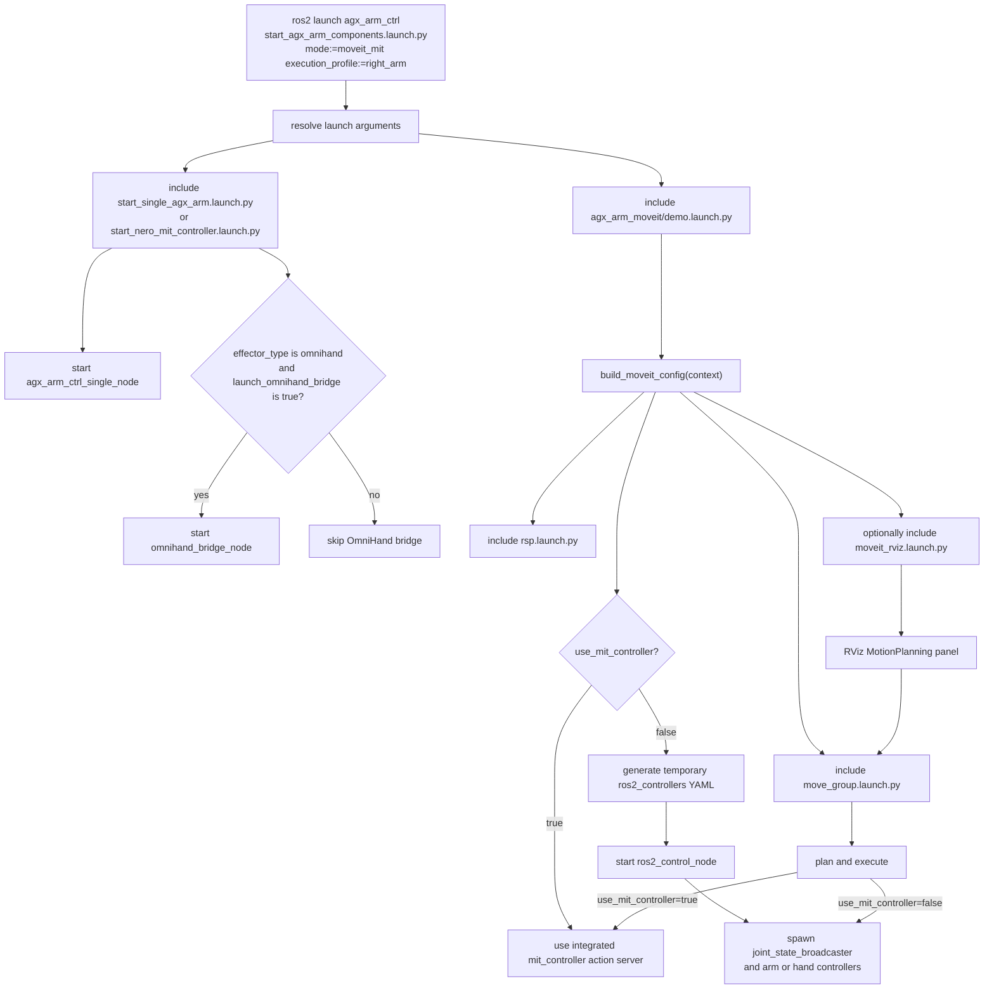
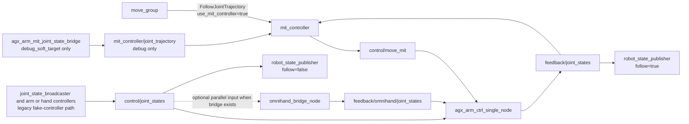
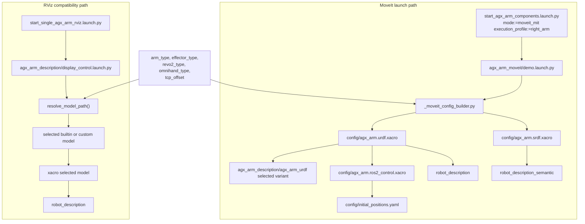

# Architecture

status: ACTIVE_MIGRATION_BASELINE
last_updated: 2026-07-18

This document is the stable architecture reference for the current Duo baseline. It focuses on how
the repo-owned runtime surfaces interact, how launch files compose them, and where the public ROS
contract lives.

Use this together with:

- `repository_structure.md` for package ownership and documentation boundaries
- `components/README.md` for the stable component index
- `../control/bringups/launches.md` for runnable entrypoints

## Architecture summary

- `src/agx_arm_ctrl` owns the runtime arm bridge, launch surfaces, and current OmniHand bridge
  integration point
- `src/agx_arm_mit_controller` owns integrated `FollowJointTrajectory`, MIT command generation, and
  gravity-aware execution
- `src/agx_arm_moveit` owns the planning baseline and fake-controller compatibility path
- `src/agx_arm_sim/agx_arm_description` remains the canonical long-term description package
- `src/duo_body_description` remains the current Duo staging surface for body-mounted system assembly
- `src/agx_arm_msgs` owns repo-specific messages such as OmniHand diagnostics and tactile payloads

## 1. ROS2 nodes and interfaces

Key contract points:

- `feedback/joint_states` is the canonical combined follow-mode state
- hand-only diagnostics stay under `feedback/omnihand/*`
- the MoveIt default path is `move_group -> mit_controller -> control/move_mit -> agx_arm_ctrl_single_node`
- the `ros2_control` branch is a compatibility path, not the preferred production execution route

## 2. Launch and runtime flow

## 3. File interaction under launches

## 4. Config and definition dataflow

```mermaid
flowchart LR
    MOVEITARGS["MoveIt launch args<br/>arm_type, effector_type,<br/>revo2_type, omnihand_type,<br/>tcp_offset, follow"] --> BUILDER["build_moveit_config()"]

    BUILDER --> URDF["config/agx_arm.urdf.xacro"]
    BUILDER --> SRDF["config/agx_arm.srdf.xacro"]
    BUILDER --> KIN["config/kinematics.yaml"]
    BUILDER --> LIMITS["config/joint_limits.yaml"]
    BUILDER --> SENSORS["config/sensors_3d.yaml"]
    BUILDER --> EXEC["config/moveit_controllers_profile.yaml"]
    BUILDER --> MOVEITNODES["move_group, RViz, robot_state_publisher"]

    URDF --> DESCPKG["agx_arm_description selected model variant"]
    URDF --> ROS2X["config/agx_arm.ros2_control.xacro"]
    ROS2X --> INIT["config/initial_positions.yaml"]

    MOVEITARGS --> MITMODE{"use_mit_controller"}
    MITMODE -- false --> TMPCTRL["_build_ros2_controllers_file(...)"]
    TMPCTRL --> TMPYAML["temporary ros2_controllers file"]
    TMPYAML --> ROS2CTRL["ros2_control_node"]
    MITMODE -- true --> MITNODE["mit_controller"]

    MITARGS["MIT launch args<br/>control_rate_hz, params_file,<br/>enable_debug_joint_trajectory_topic,<br/>launch_driver"] --> MITNODE

    ARMARGS["Arm runtime launch args<br/>can_port, pub_rate, auto_enable,<br/>speed_percent, effector_type,<br/>tcp_offset, gripper_default_effort"] --> ARMNODE["agx_arm_ctrl_single_node"]

    HANDARGS["OmniHand bridge launch args<br/>omnihand_type, backend_type,<br/>pub_rate, joint_states_command_topic,<br/>tactile_sample_count"] --> HANDNODE["omnihand_bridge_node"]
    MSGDEFS["src/agx_arm_msgs/msg/<br/>OmniHandStatus and OmniHandTactileRaw"] --> HANDNODE
```

