# Control Integrity Architecture — Authority, SDK Ownership, Recovery, External Watchdog

status: ACTIVE_BASELINE
last_updated: 2026-08-18
scope: one Duo unit — two Nero arms and two OmniHands, software control integrity, and the proposed first external watchdog

**Purpose:** several complementary views of the same runtime contracts, so
ownership, epochs, acquisition, recovery, and e-stop behaviour are easy to
reason about. This is the stable home of the control-integrity layer the V02
refactor built; `architecture.md` describes the node, launch, and configuration
surfaces around it.

> **This unit has no mechanical emergency stop.** Every "mechanical E-stop"
> below belongs to the *proposed* external watchdog, not to the hardware that
> exists: the arm is either powered or it is not. The only guaranteed stop today
> is removing arm power, and it **drops** the arm, because a de-energized Nero
> has no brakes. Nothing on this page may be read as describing an available
> protective input. See `docs/open_questions.md`, "Independent hardware
> emergency stop", and
> `docs/sprint_refactor/reference/emergency_stop_ladder.md`.

**Implementation state.** Sections 1-10 describe implemented, hardware-validated
behaviour. Sections 11-20 describe the **external watchdog, which does not
exist**: it is a design and a boundary definition, not a built component. The
decisions behind the implemented half, and the evidence for each, are in
`../sprint_refactor/planning/decision_record.md` and
`../sprint_refactor/reference/`.

---

## 1. Core vocabulary

| Concept | Scope | Purpose |
|---|---|---|
| `owner_id` | one device | identifies the current legitimate commander |
| `device_epoch` | one device | invalidates commands across ownership, recovery, rearm, or other device-local authority transitions |
| `unit_safety_epoch` | whole Duo unit | invalidates commands across a unit-wide stop/rearm era |
| `sequence` | one owner/device stream | rejects duplicate or delayed commands inside one authority era |
| `DeviceAuthority` | one commandable device | authoritative device state and admission boundary |
| `UnitSafety` | whole unit | one canonical software safety generation; **not** a protective stop |
| `SdkWorker` | one arm | exclusive steady-state SDK owner |
| Recovery owner | one arm | exclusive SDK owner while `RECOVERING`; deliberately outside the worker |
| External watchdog | below Jetson software | proposed independent takeover path when the normal host/SDK path cannot guarantee bounded protective action |

A normal arm command is valid only in the authority context in which it was created:

```text
(owner_id, device_epoch, unit_safety_epoch, sequence)
```

---

# 2. System-level authority view

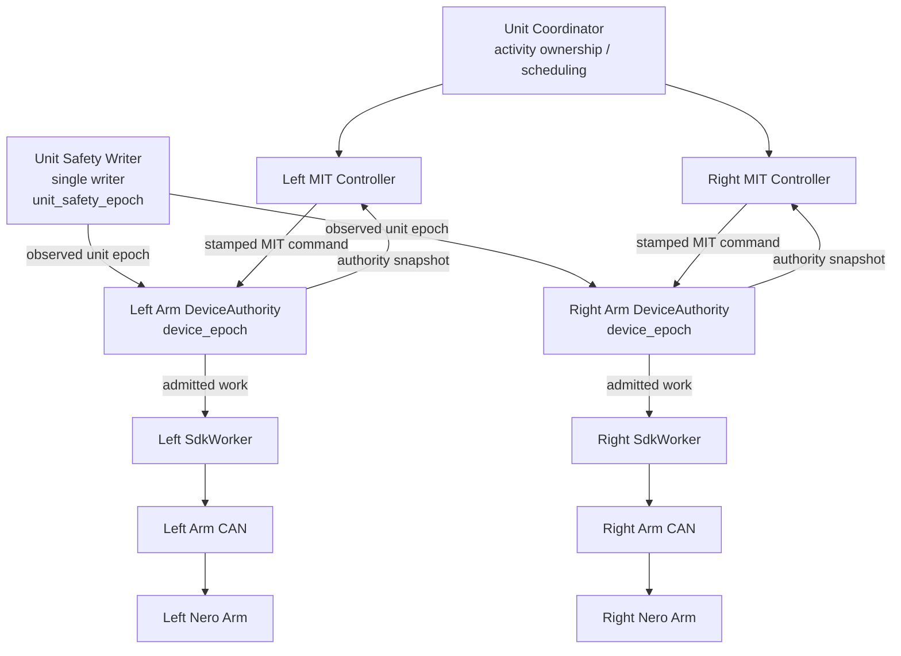

### Interpretation

The coordinator does not directly own hardware. It owns the unit activity.

The MIT controller owns setpoint generation only while its device authority permits it.

The device authority decides whether the command's owner, epochs, and sequence are still valid.

The SDK worker is the **steady-state transport owner**, not the policy authority.

---

# 3. Command admission: owner + two epochs + sequence

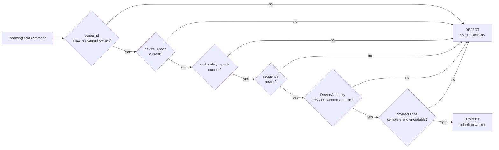

This is the central anti-stale-command contract.

A command does not become valid again merely because the hardware recovered. Recovery changes authority generations, so commands created before the transition stay dead.

---

# 4. Device authority lifecycle

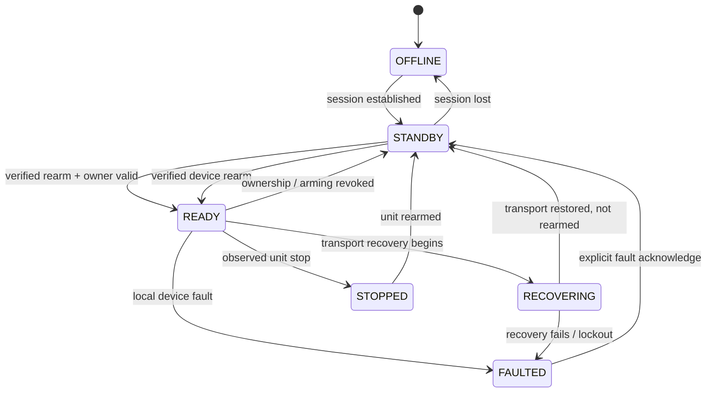

### Epoch rule

A device-local transition that invalidates in-flight work bumps `device_epoch`.

A unit-wide stop or rearm advances `unit_safety_epoch` at the single unit-safety writer.

The two epochs must remain separate: a right-arm recovery must not invalidate an unrelated hand or left-arm command unless the unit itself enters a new safety era.

---

# 5. Unit safety: local stop vs. global generation

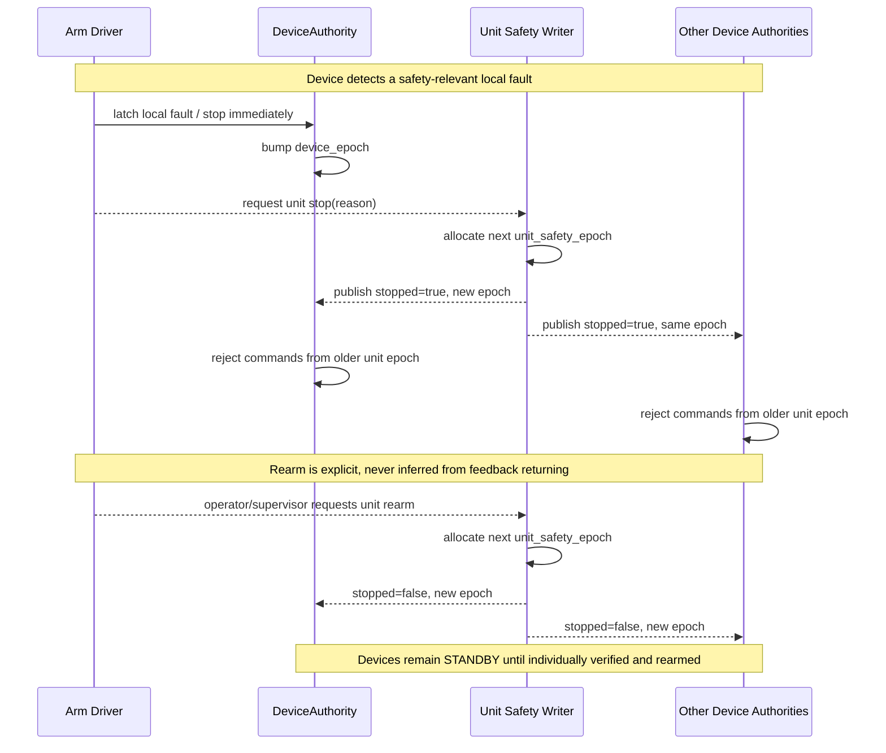

### Important boundary

`UnitSafety` is a software-wide command-generation contract.

It is **not** the external protective stop. A device must still be able to stop locally if the unit-safety writer, coordinator, ROS graph, or Jetson software is unavailable.

---

# 6. SDK ownership and worker lanes

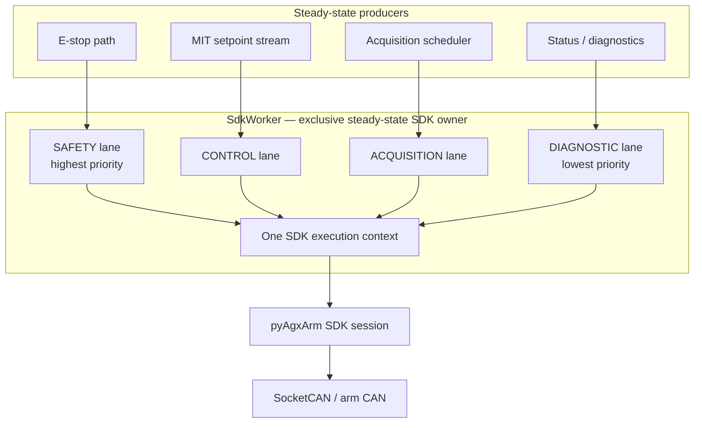

### Priority model

```text
SAFETY > CONTROL > ACQUISITION > DIAGNOSTIC
```

The safety lane can overtake **queued** work.

It cannot preempt a vendor SDK call that is already executing.

That distinction is why recovery is not routed through this worker.

---

# 7. MIT setpoint cycle and safety preemption

One logical MIT setpoint still belongs to one controller cycle, but its individual joint transmissions are interruptible by the safety lane.

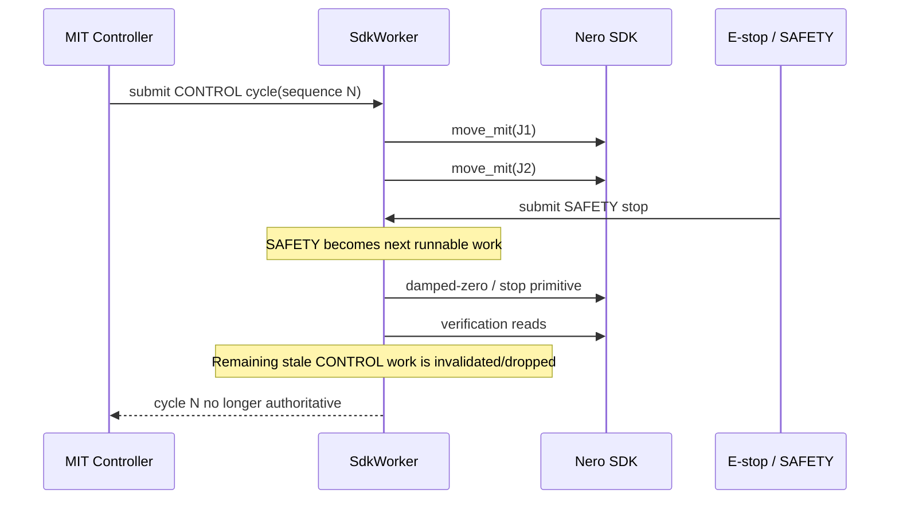

This preserves logical setpoint identity while avoiding one long non-preemptible seven-joint worker task.

---

# 8. Normal acquisition cycle

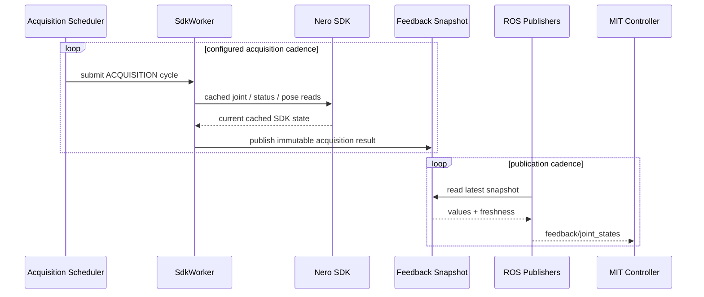

### Design intent

Acquisition cadence, ROS publication cadence, and MIT command cadence are separate concerns.

The publisher must not become the hardware owner simply because it publishes frequently.

---

# 9. Recovery/error mode: SDK ownership transfer

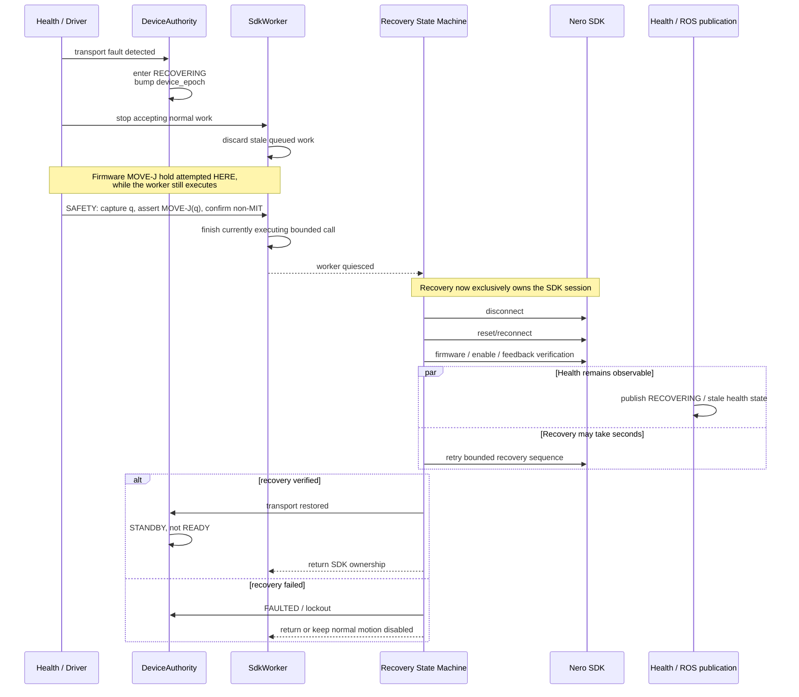

### The hold happens before the ownership transfer, not after

The order is the correction that matters. `_assert_firmware_hold()` runs on the
`SdkWorker`, so calling it from inside `_recover_bus()` — after `quiesce()` —
would submit work to a worker that no longer executes anything. The hold is
therefore attempted while the worker is still live, and only then is the session
handed to recovery.

If no trustworthy current pose exists, **no hold is claimed**. A pose synthesised
from stale feedback is a wrong hold rather than a missing one. Transport
recovery continues regardless, because the transport still needs repair; the
watchdog owns that regime.

Recovery is also **stop-aware**: a latched e-stop or an active unit stop
suppresses auto-enable. Recovery may restore enough transport and feedback to
diagnose the arm, but it must not return the hardware to ordinary enabled
operation on its own after a stop.

### Recovery escalation is fault-classified

A full SDK `disconnect()` is not the first response to every transport anomaly.

| Level | Condition | Action |
| --- | --- | --- |
| 0 | local starvation or a stale consumer — executor delay, GIL stall, socket not drained while kernel counters advance | do not reconnect; latch degraded health; recover local processing |
| 1 | SDK/parser state stale while the interface is healthy | reset read state; re-establish feedback without transport teardown |
| 2 | SocketCAN or controller fault — bus-off, interface error state | least destructive validated interface restart; avoid a full vendor disconnect |
| 3 | hard transport or session failure | firmware hold, then transfer SDK ownership, disconnect/reconnect, stay fault-latched until feedback and enable are verified |
| 4 | bounded software reaction cannot be guaranteed | the external watchdog is authoritative; software recovery is a restoration procedure only |

Level 0 is the one worth naming explicitly: an early misdiagnosis treated CPU
starvation as a bus fault and reconnected a healthy link.

### Measured architecture boundary

A destructive recovery may contain a vendor `disconnect()` call that blocks for
roughly one second, and a complete recovery sequence that takes many seconds
(13.1 s measured, three `disconnect` calls).

The architecture therefore promises:

- continued health/state observability;
- exclusive SDK ownership;
- no stale command execution;
- no automatic motion resume;
- a firmware position hold established *before* the transport is torn down,
  whenever trustworthy feedback still exists;

but **not** a bounded new SDK stop command once destructive recovery owns the
transport.

That remaining protective gap is what motivates the external watchdog.

---

# 10. E-stop in normal operation vs. during recovery

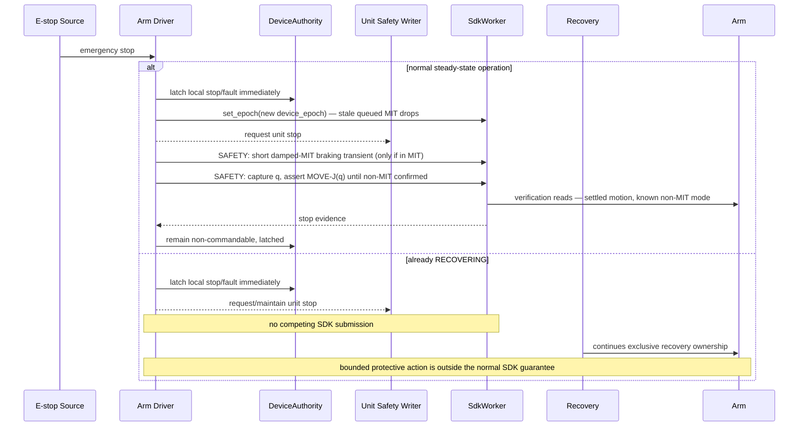

### What the terminal state is, and what it is not

```text
terminal safety state = motors enabled
                        + firmware position controller active
                        + current pose held
                        + motion authority revoked
```

- **`disable()` is not the stop primitive.** A disabled Nero has no brakes. It
  stays an explicit lifecycle/operator command.
- **A host-side MIT command is never the hold.** A kp=0 damped MIT zero stops a
  moving arm but has no stiffness, so as a terminal state it sags. It is a
  braking transient before MOVE-J, nothing more.
- **Confirmation requires a positive reading.** "Is this not MIT?" is answered
  *yes* by an unreadable status read, so silence would confirm a hold at exactly
  the moment a hold most needs checking. Only a known non-MIT move mode counts.
- **The epoch is advanced before the hold.** The safety lane overtakes queued
  work, but priority alone does not invalidate it — without
  `SdkWorker.set_epoch()` an old MIT cycle queued before the stop could execute
  after the safety MOVE-J had run.

### The quarantine applies to ingress, not to the primitive

```text
PUBLIC  /control/move_j      unauthenticated ROS ingress — quarantined, off by default
INTERNAL move_j(current_q)   the firmware-hold primitive safety logic depends on
```

Do not remove the internal call while cleaning up legacy interfaces.

### Each device carries its own quarantine, not the arm's

The arm, the hand and the parallel gripper are separate devices with separate
authority, so one switch cannot speak for all three. Each bare-command surface is
gated by the device it commands:

| Surface | Switch | Default |
| --- | --- | --- |
| arm motion on `control/joint_states`, `control/move_j`, … | `allow_legacy_motion_ingress` (arm node) | false |
| hand commands on `control/joint_states`, `control/omnihand/joint_trajectory` | `allow_legacy_hand_command_ingress` (hand bridge) | false |
| gripper commands on `control/joint_states` | `allow_legacy_gripper_command_ingress` (arm node) | false |

All three refuse for the same reason: a bare command carries no owner and no
generation, so the admission checks have nothing to check and a stale or
reordered command cannot be refused. The production surfaces are
`control/omnihand/authorized_trajectory` / `joint_target` for the hand and
`control/gripper/authorized_trajectory` for the gripper, both stamped with
`DeviceCommandStamp`.

`control/gripper/stop` is a cancel-and-hold, like the hand's: it drops the pending
target and holds the current width. It is not a latching device stop.

---

# 11. Proposed external watchdog — physical architecture

The first watchdog concept is useful **only if takeover also removes the Jetson as an active transmitter**.

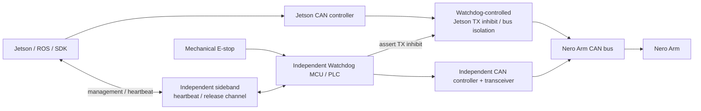

## Recommended interpretation of "throw the Jetson off the bus"

It should mean a mechanism controlled by the watchdog itself, for example:

- watchdog-controlled Jetson CAN-transceiver enable/standby;
- watchdog-controlled bus switch/isolator;
- dedicated TX gating;
- later, an inline watchdog gateway if stronger ownership is needed.

A software request to the Jetson to stop transmitting is not independent enough.

**TX-only inhibition is attractive if practical**, because the recovering Jetson can remain an observer of arm feedback while it is forbidden to command.

---

# 12. Watchdog takeover state machine

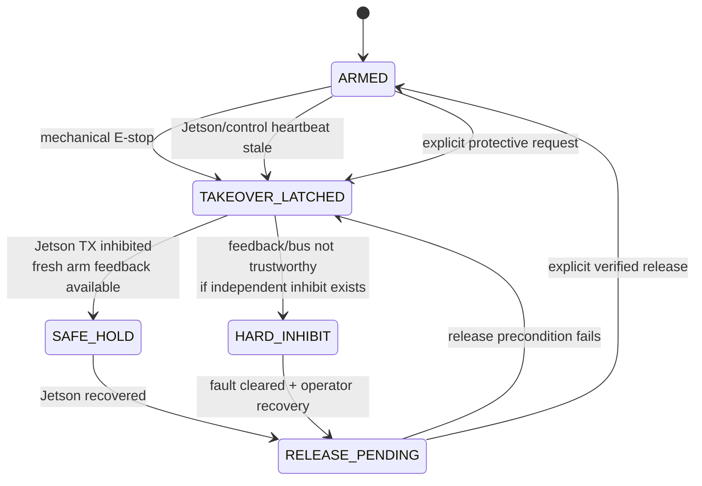

---

# 13. Watchdog takeover sequence

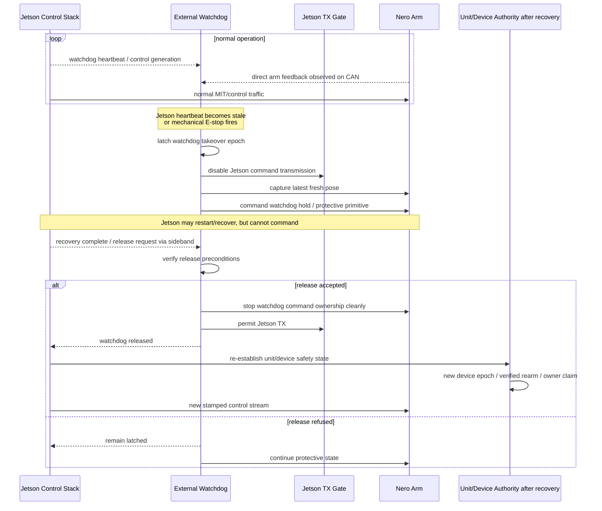

### Never auto-release

A returning heartbeat must not automatically return actuator authority to the Jetson.

A host reboot, SDK reconnect, or restored feedback is evidence that recovery may begin — not evidence that motion is safe to resume.

---

# 14. Recommended watchdog trigger model

The watchdog should distinguish two independent freshness signals.

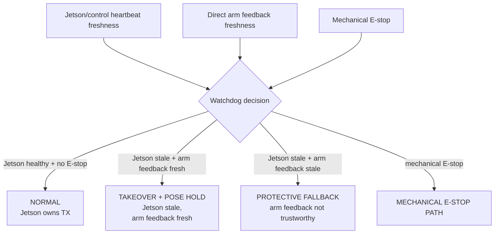

This is preferable to a single "Jetson heartbeat missing -> hold" rule.

The watchdog can observe the arm's CAN feedback itself. It therefore does not need the Jetson to tell it the arm pose before takeover.

---

# 15. Watchdog release preconditions

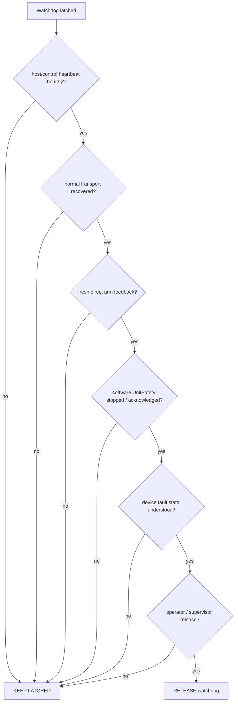

After release, the normal stack must still establish a **new** device authority era before it may send actuator commands.

---

# 16. Failure coverage

| Failure | Software DeviceAuthority / UnitSafety | External parallel-bus watchdog | Independent hard safety path |
|---|---:|---:|---:|
| stale delayed ROS command | strong | not needed | not needed |
| wrong owner / stale epoch | strong | not needed | not needed |
| Jetson process hangs | unavailable | **good coverage** | good |
| ROS executor / SDK stalls | degraded/unavailable | **good coverage** | good |
| SDK blocks in `disconnect()` | no bounded protective call | **good if watchdog CAN path remains healthy** | good |
| Jetson CAN controller fails | unavailable | **good if watchdog has independent controller/transceiver** | good |
| physical arm CAN wiring short/open | unavailable | **same bus may also fail** | required for independent coverage |
| arm transceiver failure | unavailable | same limitation | required |
| arm power loss | cannot hold | cannot hold | hardware-dependent |
| mechanical E-stop (does not exist yet) | software should observe it, but must not be sole path | can react | **preferred final protective layer** |
| arm power removed (the only guaranteed stop today) | cannot hold — the arm drops | cannot hold | hardware-dependent |

---

# 17. Assessment of the proposed first watchdog

## What is good about it

The proposed first version is architecturally useful:

1. It is independent of the Jetson process, ROS executor, SDK worker, and recovery thread.
2. It directly addresses the measured failure boundary where the normal SDK path can become unavailable for a bounded period.
3. Because it listens directly to the arm bus, it can maintain its own freshness view of arm feedback and capture a current pose independently of the Jetson.
4. A **latched takeover** integrates naturally with the existing `DeviceAuthority` / epoch model: recovering software may observe, but cannot simply resume an old command generation.
5. Keeping the first watchdog intentionally small is preferable to creating a second full robot controller.

## What must be true for it to be safe as an engineering mechanism

### A. Jetson transmission must be independently inhibited before watchdog control begins

The watchdog and Jetson must not both act as command transmitters during takeover.

The watchdog should first assert a hardware-controlled TX inhibit or bus isolation and only then send command frames.

### B. Pose hold requires fresh arm-side feedback

A watchdog pose hold should use the arm feedback observed directly by the watchdog, not a pose delivered by the stale Jetson.

Recommended logic:

```text
Jetson stale + arm feedback fresh
    -> capture latest pose
    -> takeover pose hold

Jetson stale + arm feedback stale
    -> do not trust pose hold
    -> use the strongest independent inhibit/stop primitive available
```

### C. The watchdog should implement the minimum command subset

The two Nero arms use different protocol/firmware tiers. Avoid reproducing the complete MIT controller stack.

Prefer, in order:

1. a dedicated hardware drive-disable / safety input if available;
2. a persistent firmware hold / stop command if experimentally validated;
3. a minimal tier-specific CAN hold primitive;
4. continuous MIT takeover only if the above are unavailable.

### D. Release needs an independent management path

If the watchdog physically removes Jetson TX from the arm bus, the Jetson cannot reliably negotiate its own release over that same blocked path.

Use a small independent sideband such as:

- GPIO handshake;
- UART;
- isolated serial link;
- another dedicated management channel.

The sideband can also carry the watchdog heartbeat/control generation.

### E. Mechanical E-stop and Jetson-stale takeover should not be treated as identical safety claims

A **Jetson stale** event is a good fit for controlled watchdog takeover and pose hold.

A **mechanical E-stop** should ultimately terminate in an independent protective mechanism appropriate to the risk assessment. Pose hold over the same CAN bus is useful as a controlled response, but it is not by itself an independent functional-safety emergency stop.

---

# 18. Recommended first watchdog MVP

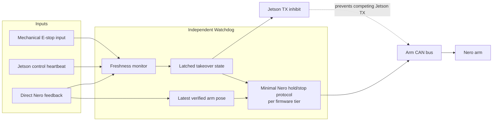

### MVP behavior

**Normal**
- watchdog passively monitors;
- Jetson is authoritative;
- watchdog tracks direct arm feedback and host/control heartbeat.

**Jetson stale**
- watchdog latches;
- disables Jetson TX;
- if arm feedback is fresh, captures current pose and commands hold;
- remains authoritative until explicit release.

**Mechanical E-stop**
- watchdog latches immediately;
- disables Jetson TX;
- executes the strongest currently available protective primitive;
- remains latched until operator-controlled recovery.

**Recovery**
- Jetson may restart and rebuild ROS/SDK state;
- watchdog remains authoritative;
- release requires explicit sideband handshake;
- software then establishes a new device epoch and owner before motion resumes.

---

# 19. Architectural rule of thumb

The four mechanisms answer four different questions:

```text
sequence
    "Is this the newest command from this owner?"

device_epoch
    "Does this command belong to the current life/ownership era of this device?"

unit_safety_epoch
    "Does this command belong to the current safety era of the whole Duo unit?"

external watchdog latch
    "Is the normal Jetson/SDK control path physically allowed to command at all?"
```

Keeping these four concepts separate is the main reason the architecture remains understandable as the system becomes more fault-tolerant.

---

# 20. Recommended next documentation step

Once the watchdog hardware choice is fixed, add a small hardware contract containing:

```text
watchdog heartbeat source
heartbeat deadline
arm-feedback freshness deadline
Jetson TX-inhibit mechanism
watchdog CAN interface
watchdog protocol tier per arm
takeover trigger conditions
pose-hold validity condition
fallback when arm feedback is stale
release sideband
watchdog takeover epoch
operator rearm policy
```

Do not hide any of these inside the ROS coordination layer. They form the boundary between **software control integrity** and the future **independent protective layer**.
