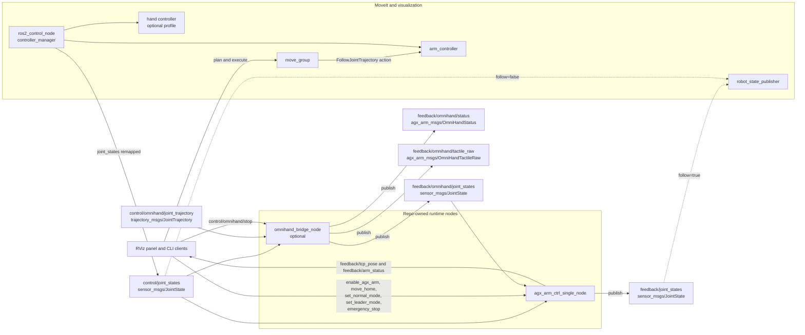
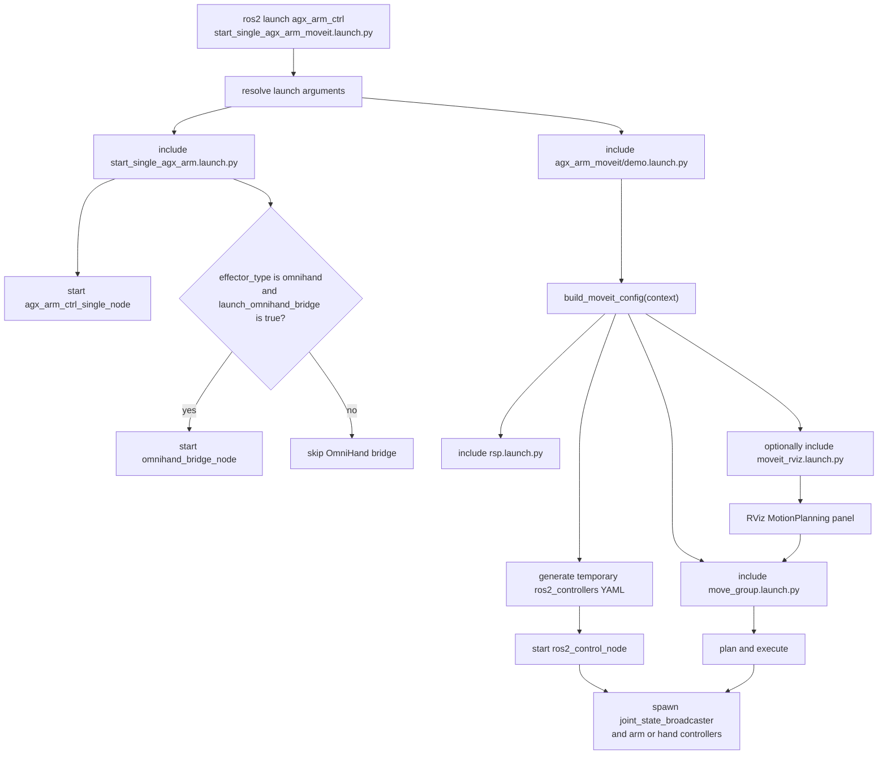
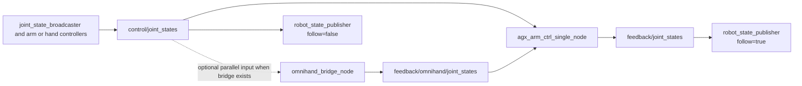
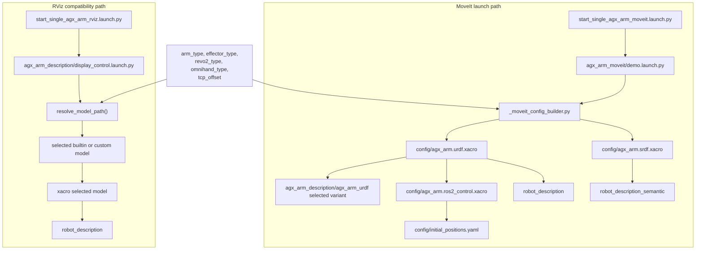
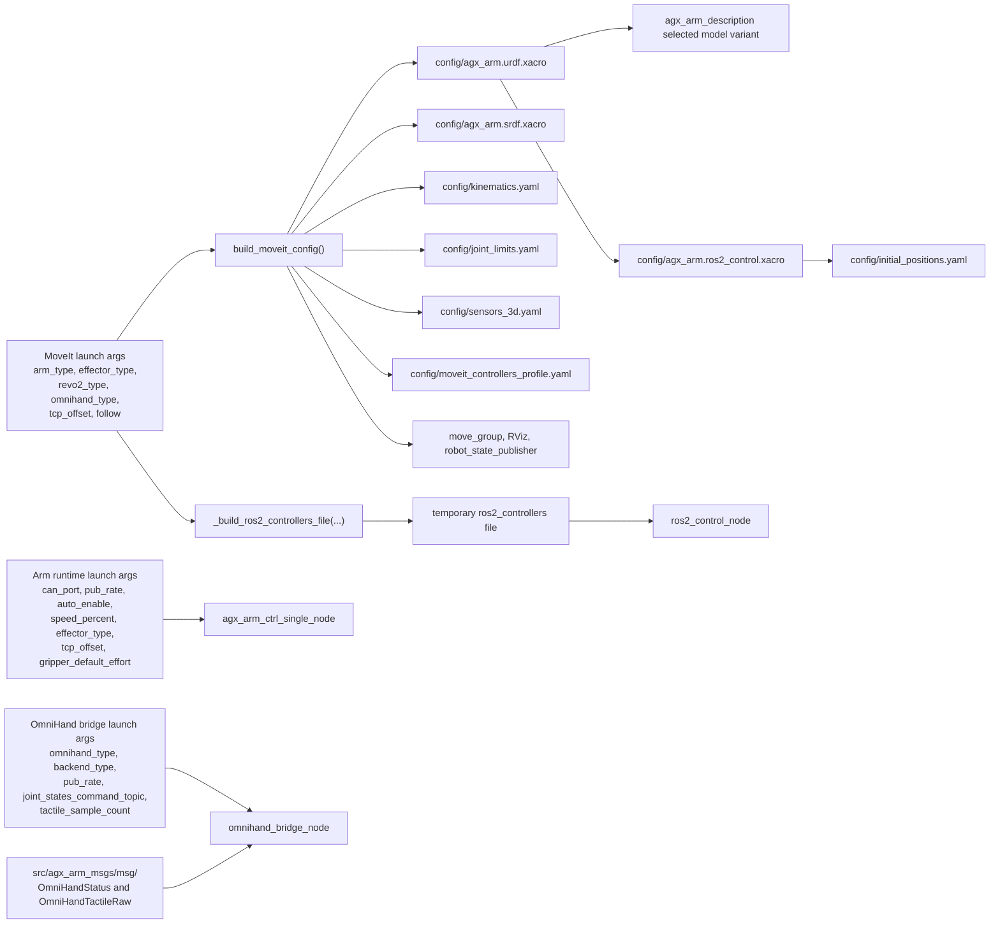

# Repo Interaction Diagrams

status: ACTIVE_SPRINT2_BASELINE
last_updated: 2026-05-17

## Purpose

This document provides the stable visual reference for how the current repo behaves during Sprint 2.

It focuses on the currently active ROS2 runtime and launch surfaces:

- `src/agx_arm_ctrl`
- `src/agx_arm_moveit`
- `src/agx_arm_sim/agx_arm_description`
- `src/agx_arm_msgs`

Use this document together with:

- `docs/project/repository_structure.md`
- `docs/project/ros2_development_practices.md`
- `docs/control/omnihand_ros_integration_options.md`
- `docs/control/omnihand_wrapper_integration_plan.md`

## 1. ROS2 Nodes And Interfaces

This diagram shows the main repo-owned ROS graph for the current arm plus MoveIt plus optional OmniHand bridge path.

Notes:

- `agx_arm_ctrl_single_node` publishes the merged `feedback/joint_states` stream.
- When `effector_type:=omnihand`, `agx_arm_ctrl_single_node` subscribes to `feedback/omnihand/joint_states` and folds those joints into the combined feedback stream.
- The OmniHand bridge currently accepts both the shared `control/joint_states` path and the compatibility `control/omnihand/joint_trajectory` path.
- `robot_state_publisher` follows real feedback when `follow:=true`; otherwise it follows the mock-controller side `control/joint_states` stream.

## 2. Launch And Runtime Event Flow

These two diagrams separate launch-time branching from runtime topic flow.

The first diagram answers which launch files and nodes are started.

The second diagram answers how the runtime data paths behave after startup.

Notes:

- The MoveIt side still uses a mock `ros2_control` system for planning and controller execution.
- `build_moveit_config(context)` does not start `omnihand_bridge_node`; bridge startup happens only inside `start_single_agx_arm.launch.py` when the launch condition is true.
- The main runtime path is `control/joint_states -> agx_arm_ctrl_single_node -> feedback/joint_states`.
- The OmniHand bridge consumes `control/joint_states` only as an optional parallel branch and never as a required hop for the arm controller path.
- When `effector_type:=omnihand`, `agx_arm_ctrl_single_node` also subscribes to `feedback/omnihand/joint_states` and merges those joints into the combined feedback stream.
- `follow:=true` makes the published robot model follow real feedback; `follow:=false` keeps visualization on the MoveIt/mock-controller side.

## 3. File Interaction Under Launches

This diagram shows how launch files pull together URDF, Xacro, SRDF, and description assets.

Notes:

- The MoveIt path builds its own `robot_description` and `robot_description_semantic` through `agx_arm_moveit/config/*.xacro`.
- The RViz compatibility path resolves directly into the canonical `agx_arm_description` asset tree.
- `tcp_offset` becomes a fixed `tcp_link` joint in the MoveIt URDF path and becomes an optional `static_transform_publisher` in the RViz compatibility path when the offset is nonzero.

## 4. Config And Definition Dataflow

This diagram shows which configuration files and definitions feed the current runtime.

Notes:

- The `moveit_controllers_profile.yaml` label stands for the profile selected by `effector_type`, for example `moveit_controllers_none.yaml` or `moveit_controllers_omnihand_left.yaml`.
- The temporary `ros2_controllers` file is generated at launch time from the selected arm and hand profile.
- Runtime node parameters are still sourced directly from launch arguments rather than from a single shared runtime YAML.