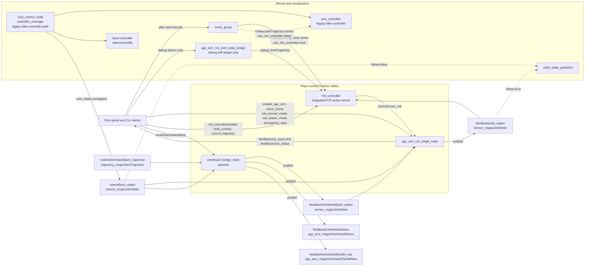
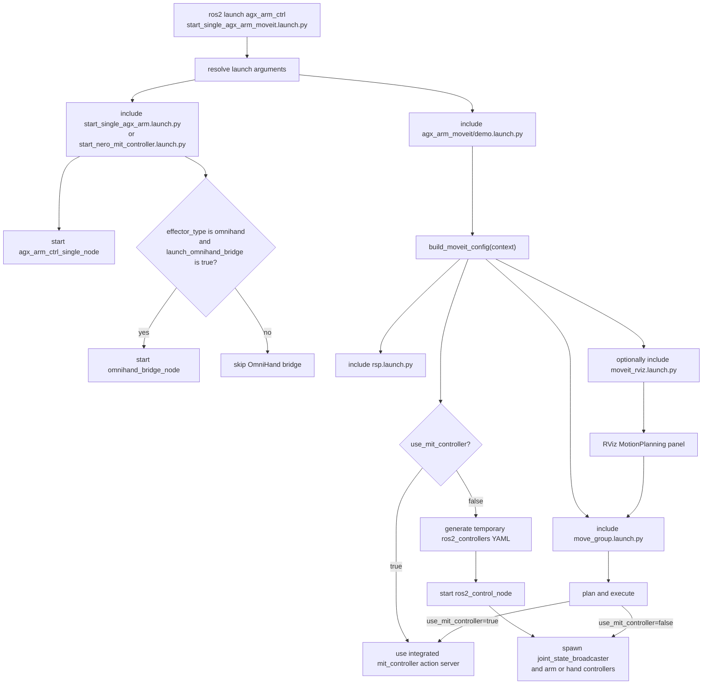
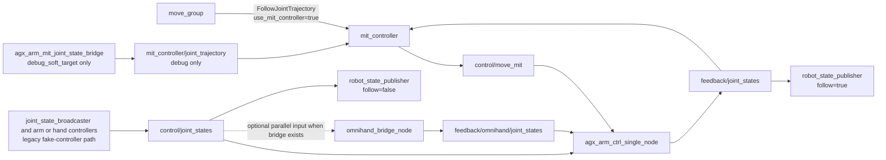
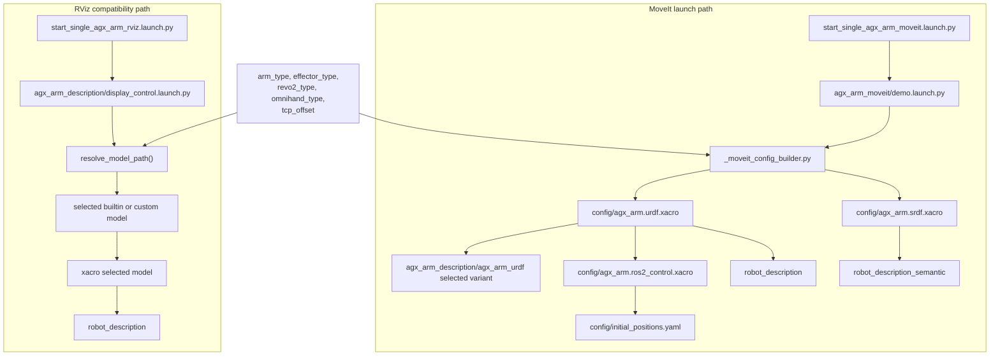
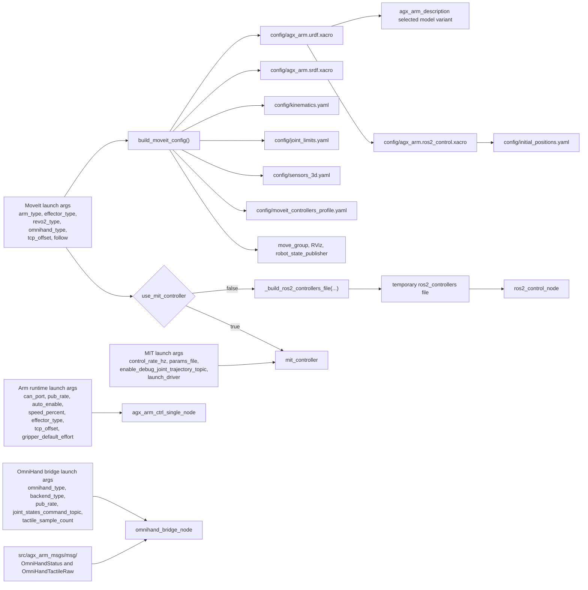

# Repo Interaction Diagrams

status: ACTIVE_DUO_BASELINE
last_updated: 2026-07-02

## Purpose

This document provides the stable visual reference for how the current repo behaves in the Duo baseline.

It focuses on the currently active ROS2 runtime and launch surfaces:

- `src/agx_arm_ctrl`
- `src/agx_arm_mit_controller`
- `src/agx_arm_moveit`
- `src/agx_arm_sim/agx_arm_description`
- `src/agx_arm_msgs`

`src/duo_body_description` is intentionally not a primary actor in these diagrams yet. It is the current description-only Sprint 3 and Sprint 4 staging package for Duo body system bringup, while the runtime ownership shown here remains in the existing `agx_arm_*` packages.

Use this document together with:

- `docs/project/repository_structure.md`
- `.claude/rules/ros2-development.md`
- `docs/assets/omnihand/omnihand_ros_integration_options.md`
- `docs/assets/omnihand/omnihand_wrapper_integration_plan.md`

## 1. ROS2 Nodes And Interfaces

This diagram shows the main repo-owned ROS graph for the current arm plus MoveIt plus optional OmniHand bridge path.

Notes:

- `agx_arm_ctrl_single_node` publishes the merged `feedback/joint_states` stream.
- `mit_controller` is the default execution target for MoveIt when `use_mit_controller:=true`.
- The `ros2_control_node` plus `controller_manager` branch is only the legacy fake-controller execution path when `use_mit_controller:=false`.
- `agx_arm_mit_joint_state_bridge` is a debug-only RViz helper and should not be treated as the production execution path.
- When `effector_type:=omnihand`, `agx_arm_ctrl_single_node` subscribes to `feedback/omnihand/joint_states` and folds those joints into the combined feedback stream.
- The OmniHand bridge currently accepts both the shared `control/joint_states` path and the compatibility `control/omnihand/joint_trajectory` path.
- `robot_state_publisher` follows real feedback when `follow:=true`; otherwise it follows the mock-controller side `control/joint_states` stream.

## 2. Launch And Runtime Event Flow

These two diagrams separate launch-time branching from runtime topic flow.

The first diagram answers which launch files and nodes are started.

The second diagram answers how the runtime data paths behave after startup.

Notes:

- The MoveIt side uses the integrated `mit_controller` action server by default and only falls back to the mock `ros2_control` system when `use_mit_controller:=false`.
- `build_moveit_config(context)` does not start `omnihand_bridge_node`; bridge startup happens only inside `start_single_agx_arm.launch.py` when the launch condition is true.
- The main runtime execution path in MIT mode is `move_group -> mit_controller -> control/move_mit -> agx_arm_ctrl_single_node -> feedback/joint_states`.
- The `mit_controller/joint_trajectory` debug topic is only for explicit RViz soft-target debugging.
- The OmniHand bridge consumes `control/joint_states` only as an optional parallel branch and never as a required hop for the arm controller path.
- When `effector_type:=omnihand`, `agx_arm_ctrl_single_node` also subscribes to `feedback/omnihand/joint_states` and merges those joints into the combined feedback stream.
- `follow:=true` makes the published robot model follow real feedback; `follow:=false` keeps visualization on the MoveIt/mock-controller side.

## 3. File Interaction Under Launches

This diagram shows how launch files pull together URDF, Xacro, SRDF, and description assets.

Notes:

- The MoveIt path builds its own `robot_description` and `robot_description_semantic` through `agx_arm_moveit/config/*.xacro`.
- The RViz compatibility path resolves directly into the canonical `agx_arm_description` asset tree.
- `tcp_offset` becomes a fixed `tcp_link` joint off `nero_tool0` in the MoveIt URDF path.
- In the built-in Nero RViz compatibility path, `display_control.launch.py` now always publishes the `nero_tool0` to `tcp_link` transform, including the zero-offset case.
- If `custom_model` is used in RViz, the custom asset owns its own TCP/flange frames and `display_control.launch.py` does not inject a Nero-specific `tcp_link` transform.

## 4. Config And Definition Dataflow

This diagram shows which configuration files and definitions feed the current runtime.

Notes:

- The `moveit_controllers_profile.yaml` label stands for the selected controller profile, including `moveit_controllers_mit.yaml` when `use_mit_controller:=true`.
- The temporary `ros2_controllers` file is generated only for the legacy fake-controller branch when `use_mit_controller:=false`.
- MIT runtime parameters are sourced from launch arguments plus the MIT params YAML, and the debug `joint_trajectory` input stays opt-in.
- Runtime node parameters are still sourced directly from launch arguments rather than from a single shared runtime YAML.