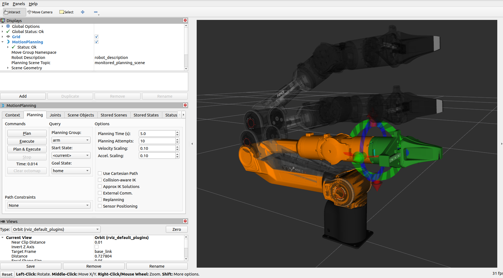

# agx_arm_moveit

[English](./README_EN.md)

|ROS |STATE|
|---|---|
|||
|||

> 注：当前工作区的活动 MoveIt 配置已收敛到 Nero 资产树，`arm_type` 仅保留 `nero`。

## 概述

`agx_arm_moveit` 是当前工作区的 Nero 专用 MoveIt2 配置包。

当前支持范围：

- 臂型：`nero`
- 末端执行器：`none`、`agx_gripper`、`revo2`、`omnihand`
- 规划组：内置单臂模型下的 `nero_arm` 及末端执行器组，以及 staged Duo custom model 路径下的 `right_arm` 或 `left_arm` 加对应手部 end-effector 组；`both_arms` 继续作为仅机械臂的双臂规划切片
- 运动学插件：TRAC-IK（`trac_ik_kinematics_plugin/TRAC_IKKinematicsPlugin`）

## 1 安装

### 1.1 安装 MoveIt2

```bash
sudo apt install ros-$ROS_DISTRO-moveit*
```

### 1.2 安装额外依赖

```bash
sudo apt-get install -y \
    ros-$ROS_DISTRO-control* \
    ros-$ROS_DISTRO-joint-trajectory-controller \
    ros-$ROS_DISTRO-joint-state-* \
    ros-$ROS_DISTRO-gripper-controllers \
  ros-$ROS_DISTRO-trajectory-msgs
```

若 apt 元数据里存在 `ros-$ROS_DISTRO-trac-ik-kinematics-plugin`，请额外安装：

```bash
sudo apt-get install -y ros-$ROS_DISTRO-trac-ik-kinematics-plugin
```

若 Humble / Jetson 主机没有该 apt 包，请参考英文复现实录 `../../docs/development/sprint3/planning/trac_ik_humble_jetson_repro.md` 中的独立 overlay 构建方法。

若系统区域设置不是英文，启动前请设置：

```bash
echo "export LC_NUMERIC=en_US.UTF-8" >> ~/.bashrc
source ~/.bashrc
```

## 2 使用方法

### 2.1 仿真演示

```bash
cd ~/agx_arm_ws
source /opt/ros/$ROS_DISTRO/setup.bash
if [ -f ~/workspace/trac_ik_ws/install/setup.bash ]; then source ~/workspace/trac_ik_ws/install/setup.bash; fi
source install/setup.bash
```

若使用发行版提供的 TRAC-IK apt 包，上述条件判断会直接跳过 overlay source。

规范的包内 MoveIt 启动入口：

无末端执行器：

```bash
ros2 launch agx_arm_moveit start_moveit.launch.py arm_type:=nero
```

带 AgileX 夹爪：

```bash
ros2 launch agx_arm_moveit start_moveit.launch.py arm_type:=nero effector_type:=agx_gripper
```

带 Revo2 灵巧手：

```bash
ros2 launch agx_arm_moveit start_moveit.launch.py arm_type:=nero effector_type:=revo2 revo2_type:=left
```

带 OmniHand 灵巧手：

```bash
ros2 launch agx_arm_moveit start_moveit.launch.py arm_type:=nero effector_type:=omnihand omnihand_type:=left
```

加载仓库内置的简易障碍物基线：

```bash
ros2 launch agx_arm_moveit start_moveit.launch.py arm_type:=nero load_simple_obstacles:=true
```

该选项会调用 `scripts/apply_simple_obstacles.py`，将 `config/simple_obstacles.json` 中的基础障碍物集合注入 MoveIt 规划场景。若需替换障碍物集合，可传入 `simple_obstacles_config:=/abs/path/to/file.json`。

### 2.2 控制真实机械臂

推荐使用新的公共组件启动面来走原生 MIT 执行路径：

```bash
ros2 launch agx_arm_ctrl start_agx_arm_components.launch.py \
  mode:=moveit_mit \
  can_port:=can_nero \
  arm_type:=nero \
  effector_type:=agx_gripper \
  load_simple_obstacles:=true
```

规范的一键 MoveIt 包装启动名称：

```bash
ros2 launch agx_arm_ctrl start_agx_arm_moveit.launch.py \
  can_port:=can_nero \
  arm_type:=nero \
  effector_type:=agx_gripper \
  load_simple_obstacles:=true
```

兼容旧的一键启动名称：

```bash
ros2 launch agx_arm_ctrl start_single_agx_arm_moveit.launch.py \
  can_port:=can_nero \
  arm_type:=nero \
  effector_type:=agx_gripper \
  load_simple_obstacles:=true
```

该一键启动路径默认 `use_mit_controller:=true`，因此 MoveIt 的 `arm_controller/follow_joint_trajectory` 会直接连接到 `mit_controller` 暴露的集成 action server，由 MIT 控制器负责轨迹采样、容差检查和 `/control/move_mit` 发布，而不是使用 fake `ros2_control` 或独立桥接节点。若需退回旧路径，可显式设置 `use_mit_controller:=false`。

带 Revo2 的一键启动示例：

```bash
ros2 launch agx_arm_ctrl start_single_agx_arm_moveit.launch.py \
  can_port:=can_nero \
  arm_type:=nero \
  effector_type:=revo2 \
  revo2_type:=left
```

共享的 config-based 包装启动面现在已经打通第一条按侧别区分的 OmniHand 路径，可通过 `execution_profile:=left_hand|right_hand` 一次性解析 staged Duo custom model、prefixed arm chain、`effector_type:=omnihand` 以及匹配的 bridge 默认值：

```bash
ros2 launch agx_arm_ctrl start_agx_arm_moveit.launch.py \
  execution_profile:=right_hand \
  can_port:=can_right \
  follow:=true \
  use_rviz:=false
```

这一契约目前仍然是单臂的。`moveit_profile:=both_arms` 与 `execution_profile:=duo_arm` 继续保持 arm-only，直到共享双手的碰撞矩阵与控制器归属语义明确下来。

若采用分步启动并保留 MIT 软轨迹路径，推荐使用以下方式让 MoveIt 跟随真实反馈并通过 MIT 执行轨迹：

```bash
# 终端 1
ros2 launch agx_arm_mit_controller start_nero_mit_controller.launch.py \
  can_port:=can_nero \
  arm_type:=nero \
  effector_type:=agx_gripper \
  publish_gripper_joint:=false

# 终端 2
ros2 launch agx_arm_moveit start_moveit.launch.py \
  arm_type:=nero \
  effector_type:=agx_gripper \
  follow:=true \
  use_mit_controller:=true \
  load_simple_obstacles:=true
```

当 `use_mit_controller:=true` 时，`start_moveit.launch.py` 不再启动旧的桥接执行路径，而是要求 MIT 控制器已经提供 `arm_controller/follow_joint_trajectory`。`demo.launch.py` 现在仅保留为指向同一实现的兼容别名。

当前 Sprint 4 的 prefixed Duo 单臂控制路径也已打通，可将 MoveIt 绑定到 body-mounted custom model 的某一侧机械臂，同时仍通过该臂命名空间内的 MIT controller 执行轨迹：

```bash
ros2 launch agx_arm_moveit demo.launch.py \
  use_rviz:=false \
  use_mit_controller:=true \
  follow:=true \
  follow_joint_states_topic:=feedback/prefixed_joint_states \
  moveit_profile:=right_arm \
  robot_name:=duo_nero_system \
  custom_model:=/home/user/workspace/agx_arm_ros/src/duo_body_description/urdf/duo_system.urdf.xacro \
  custom_model_xacro_args:='use_left_arm:=false use_left_hand:=false use_right_arm:=true use_right_hand:=true' \
  planning_pipelines:=ompl
```

其中 `moveit_profile:=right_arm` 会自动推导 `right_arm_` 前缀、`right_arm` 规划组、`right_arm_base_link` 和 `right_arm_nero_tool0`。`left_arm` 镜像路径使用相同契约。若需要覆盖这些默认值，仍可显式传入 `input_joint_prefix`、`arm_base_frame`、`arm_tip_frame`。

`both_arms` 也已作为首个双臂规划 profile 落地。现在既可以走包内的 `agx_arm_moveit start_moveit.launch.py`，也可以在提供双臂 `arm_instances` 时走 `agx_arm_ctrl start_agx_arm_components.launch.py mode:=moveit_mit` 的统一入口：

```bash
ros2 launch agx_arm_ctrl start_agx_arm_components.launch.py \
  mode:=moveit_mit \
  use_rviz:=false \
  follow:=true \
  moveit_profile:=both_arms \
  custom_model:=/home/user/workspace/agx_arm_ros/src/duo_body_description/urdf/duo_system.urdf.xacro \
  custom_model_xacro_args:='use_left_arm:=true use_left_hand:=false use_right_arm:=true use_right_hand:=false' \
  arm_instances:='[{name: left_arm, namespace: left_arm, can_port: can_left, joint_prefix: left_arm_, feedback_joint_prefix: left_arm_, launch_driver: false}, {name: right_arm, namespace: right_arm, can_port: can_right, joint_prefix: right_arm_, feedback_joint_prefix: right_arm_, launch_driver: false}]' \
  planning_pipelines:=ompl
```

该 profile 会生成 `left_arm`、`right_arm` 和组合后的 `both_arms` 规划组，并为左右臂分别加载 IK。统一包装启动面现在还能按 `arm_instances` 为每个 prefix 启动一个 MIT controller，把每个 arm runtime 放到自己的 namespace 中，并把 prefixed feedback 合并回 MoveIt / RViz。`start_moveit.launch.py` 是规范的包内入口；`demo.launch.py` 仅保留为兼容别名。

共享的双臂 MIT 包装启动面现在还会自动启动 `agx_arm_duo_soft_estop`。它提供 `/emergency_stop` 作为当前的中心化软停入口，并提供按臂的 `hold_<namespace>` 服务，将 `cancel_trajectory` 与 `hold_current` 扇出到各自的 MIT namespace。未来若要做单臂选择性固定，可在这些按臂 hook 上继续扩展，而不必改动当前的中心化停机契约。

若走 `agx_arm_ctrl start_single_agx_arm_moveit.launch.py` 或 `agx_arm_ctrl start_agx_arm_components.launch.py mode:=moveit_mit` 包装启动，同样可透传 `moveit_profile`、`robot_name`、`custom_model`、`custom_model_xacro_args`，并继续使用自动推导的 prefixed feedback adapter。

### 2.3 启动参数

| 参数 | 默认值 | 说明 | 可选值 |
|------|--------|------|--------|
| `arm_type` | `nero` | 机械臂型号 | `nero` |
| `moveit_profile` | `nero_arm` | MoveIt 规划 profile；`right_arm` / `left_arm` 会自动推导 Duo custom model 的前缀、group 与 arm chain 帧，`both_arms` 会生成双臂组合规划组 | `nero_arm`, `right_arm`, `left_arm`, `both_arms` |
| `robot_name` | `agx_arm` | SRDF 使用的机器人名；custom model 的 URDF 名称不同步时需要覆盖，例如 `duo_nero_system` | 任意合法 robot name |
| `custom_model` | 空字符串 | 可选 custom model 路径；设置后 MoveIt 直接对该 xacro/URDF 建模，而不是使用内置单臂描述 | 任意可读 xacro/URDF |
| `custom_model_xacro_args` | 空字符串 | `custom_model` 额外透传的 xacro 参数字符串 | 任意合法 xacro 参数 |
| `effector_type` | `none` | 末端执行器类型 | `none`, `agx_gripper`, `revo2`, `omnihand` |
| `revo2_type` | `left` | Revo2 灵巧手类型 | `left`, `right` |
| `omnihand_type` | `left` | OmniHand 左右手类型 | `left`, `right` |
| `namespace` | 空字符串 | 当前 MoveIt/控制实例命名空间 | 任意合法 ROS 命名空间 |
| `input_joint_prefix` | 空字符串 | prefixed custom model 中当前受控机械臂的关节前缀；会同时用于控制器 joint 列表和 MIT 轨迹边界适配 | 例如 `right_arm_` |
| `feedback_joint_prefix` | 空字符串 | 合并后的 follow 侧反馈重新附加的前缀；主要供公共多臂包装启动面使用 | 例如 `left_arm_` |
| `arm_instances` | 空字符串 | 可选的 YAML 列表，用于描述受管 arm runtime 实例；`moveit_profile:=both_arms` 的公共包装入口需要它 | arm instance 映射组成的 YAML 列表 |
| `arm_base_frame` | 空字符串 | custom model 下 MoveIt arm chain 的 base link；留空时会按前缀自动推导 | 例如 `right_arm_base_link` |
| `arm_tip_frame` | 空字符串 | custom model 下 MoveIt arm chain 的 tip link；留空时会按前缀自动推导 | 例如 `right_arm_nero_tool0` |
| `follow` | `false` | `true` 时订阅 `/feedback/joint_states`，推荐用于真机 / MIT 路径；`false` 时订阅 `/control/joint_states` | `true`, `false` |
| `follow_joint_states_topic` | `feedback/joint_states` | 当 `follow:=true` 时消费的 JointState 话题；多臂前缀模型可指向适配后的反馈话题 | 任意合法 topic |
| `tcp_offset` | `[0.0, 0.0, 0.0, 0.0, 0.0, 0.0]` | TCP 偏移 [x, y, z, rx, ry, rz]（米/弧度） | - |
| `use_mit_controller` | `false` | `true` 时跳过 fake `ros2_control`，加载 `moveit_controllers_mit.yaml`，并要求 `mit_controller` 提供 `arm_controller/follow_joint_trajectory` | `true`, `false` |
| `use_rviz` | `true` | 是否启动 RViz | `true`, `false` |
| `db` | `false` | 是否启动 MoveIt warehouse 数据库 | `true`, `false` |
| `planning_pipelines` | 空字符串 | 可选的逗号分隔规划流水线白名单，会透传到 `move_group.launch.py`；留空时使用包内默认值 | 例如 `ompl`、`ompl,chomp` |
| `load_simple_obstacles` | `false` | 是否加载仓库内置的基础障碍物集合 | `true`, `false` |
| `simple_obstacles_config` | `config/simple_obstacles.json` | 规划场景障碍物 JSON 配置文件路径 | 任意可读 JSON 路径 |

### 2.4 当前约束

- 当前活动配置只覆盖 Nero，不再暴露 Piper 系列启动选项。
- `namespace` 仍可用于多实例隔离，但多个实例都应基于 Nero 资产树。
- `publish_gripper_joint` 会在一键启动路径中自动处理，以避免 MoveIt 中出现无效关节告警。
- `start_moveit.launch.py` 现在是规范的包内 MoveIt 启动名。`demo.launch.py` 保留为兼容别名。
- `start_agx_arm_moveit.launch.py` 现在是规范的一键 MoveIt 包装启动名。`start_single_agx_arm_moveit.launch.py` 保留为兼容别名；底层 `start_single_agx_arm.launch.py` 仍准确对应单个驱动实例。
- `moveit_profile:=right_arm`、`moveit_profile:=left_arm` 与 `moveit_profile:=both_arms` 已落地为第一批 Duo profile。在共享 `agx_arm_ctrl` 包装启动面上，`execution_profile:=left_hand|right_hand` 现在已经解析出第一批 hand-aware 单臂 config path；`both_arms` 与 `execution_profile:=duo_arm` 仍按设计保持 arm-only。
- `start_agx_arm_components.launch.py` 提供新的公共 agx_arm_ctrl 组件启动面，包含 `manual_vendor`、`debug_soft_target`、`moveit_mit` 三种模式。
- 当前 MoveIt 基线要求 TRAC-IK；若 Humble / Jetson 主机没有可用的 apt 包，请参考英文复现实录 `../../docs/development/sprint3/planning/trac_ik_humble_jetson_repro.md` 中的独立 overlay 构建方法。
- `nero_tool0` 现在由 Nero 规范描述包直接提供，`tcp_link` 继续作为 TCP 与交互式规划目标参考帧。
- `config/simple_obstacles.json` 只提供早期规划验证的保守基线；进入真机执行前仍应根据现场工装与工作空间自行调整。
- `share/agx_arm_moveit/scripts/plan_pose_smoke_test.py` 提供当前 Sprint 3 使用的仓库内近 home 位姿 OMPL 规划烟雾测试。
- 对 `none`、`agx_gripper`、`revo2`、`omnihand` 各配置做纯仿真 MoveIt 集成验证，是进入真机碰撞检查执行前的有效路径。
- staged Duo 的 gravity slice 现在会把活动中的 OmniHand 作为固定姿态 payload 保留下来，即在派生 URDF 中把手部关节冻结到零位。MIT controller 仍只控制 Nero 的七个关节；动态手姿补偿仍是后续工作。
- 当前的按臂 OmniHand 路径已经覆盖 staged Duo MoveIt、RViz、生成的 SRDF、config-based `agx_arm_ctrl` 包装启动面以及 MIT gravity payload 切片。双臂带手执行和 hand-aware `both_arms` 契约仍未完成。
- 2026-05-28 的验证表明，`plan_pose_smoke_test.py` 已能在 `nero_arm` 上成功拿到代表性的 `ompl` 位姿规划结果，但 Humble/aarch64 主机上的 `move_group` 退出崩溃即使在 `planning_pipelines:=ompl` 的精简路径下仍会复现。

### 2.5 RViz 操作



- 拖动机械臂末端的交互标记来设定目标位姿。
- 在左侧 MotionPlanning 面板中切换内置单臂模型的 `nero_arm`、`gripper`、`hand` 规划组，或 staged Duo custom model 路径下的 `right_arm`、`left_arm`、`both_arms` 规划组。包装启动层的 `left_hand` / `right_hand` execution profile 会复用对应单臂规划组，并叠加 staged OmniHand end-effector 组。
- 在 Goal State 中选择 `home`、`gripper_open`、`hand_half_close`、`hand_close` 等预设状态。

## 3 常见问题

### 3.1 启动时报 `double`/`string` 匹配错误

通常是区域设置导致的小数解析问题。执行：

```bash
echo "export LC_NUMERIC=en_US.UTF-8" >> ~/.bashrc
source ~/.bashrc
```

或者在单次启动前显式设置：

```bash
LC_NUMERIC=en_US.UTF-8 ros2 launch agx_arm_moveit demo.launch.py arm_type:=nero
```
